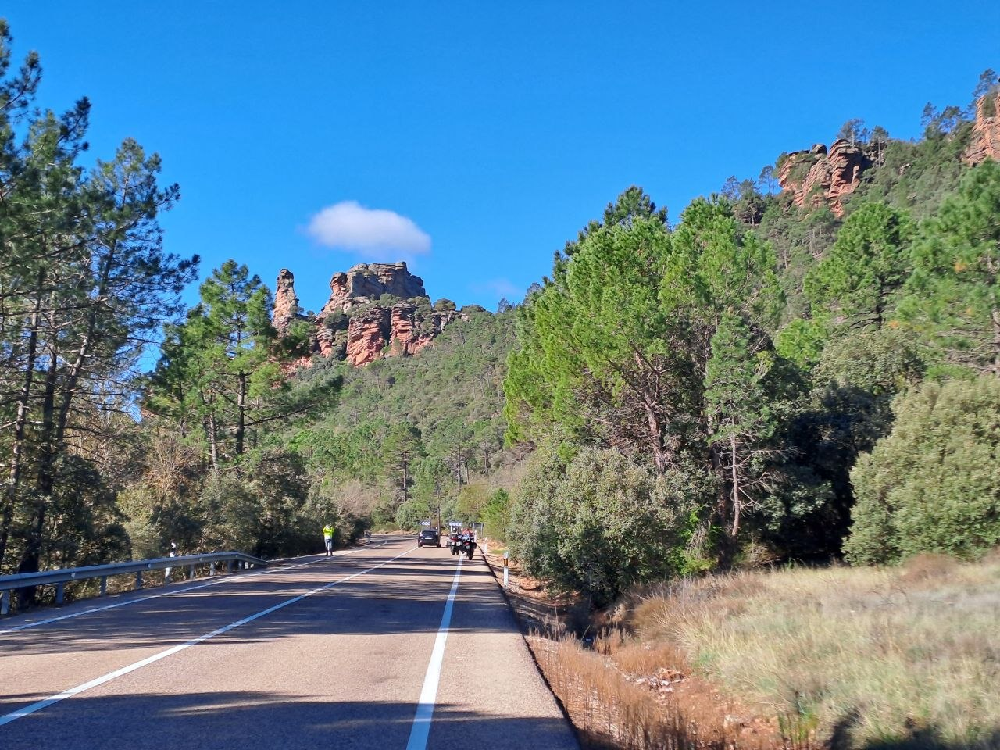

### Day Two: A Spanish Motorcycle Odyssey

April 14 marked the second day of our motorcycle journey through Spain with four friends. Our route for the day took us from the historic town of Albarracín, through a brief stop in Alcaraz, before concluding in Úbeda.

### Breathtaking Roads and Landscapes

The roads throughout this leg of our trip were exceptionally beautiful, offering a smooth ride with virtually no traffic. This allowed for an immersive experience, inviting us to enjoy the ride and the stunning vistas at our leisure. The landscapes were truly breathtaking, providing a continuous spectacle of natural beauty.

We were particularly impressed by the extensive olive groves stretching as far as the eye could see, especially those encountered between Alcaraz and Úbeda. These vast, meticulously cultivated olive tree fields covered hectares upon hectares of land, creating a uniquely impressive sight.

### Regions Explored

Our journey today covered approximately 400 kilometers, following a nearly 440-kilometer ride the previous day. This route led us through distinct Spanish regions, each with its unique charm:

*   **Aragon (Beginning in Albarracín):** This region, home to our starting point, Albarracín, is known for its dramatic medieval architecture perched on hillsides and surrounded by rugged, forested terrain. It offers a glimpse into Spain's historical past amidst striking natural beauty.

*   **Castilla-La Mancha (Via Alcaraz):** As we traversed through Castilla-La Mancha, passing through Alcaraz, the landscape began to shift. This region is characterized by its vast plains, historical towns, and a transition into agricultural dominance, including early signs of the olive groves that would soon become ubiquitous.

*   **Andalusia (Ending in Úbeda):** Our destination, Úbeda, is nestled in Andalusia, a region famed for its rich cultural heritage and especially its Renaissance architecture, which has earned it UNESCO World Heritage status. Andalusia is also the heartland of Spain's olive oil production, a fact vividly illustrated by the endless olive groves that surrounded Úbeda.

The ride offered a memorable combination of exhilarating travel and profound appreciation for Spain's diverse and captivating scenery, from its historical towns to its iconic agricultural expanses.

