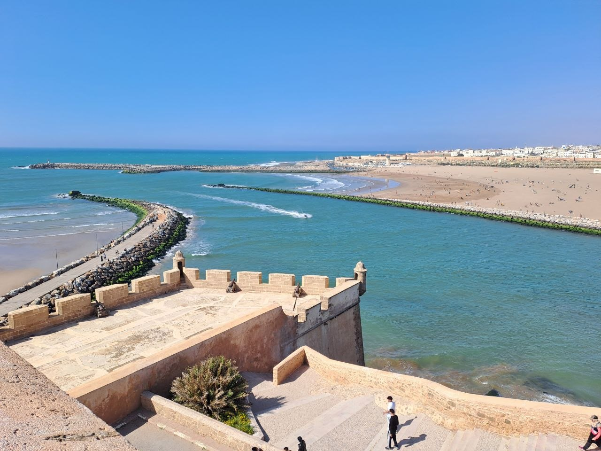
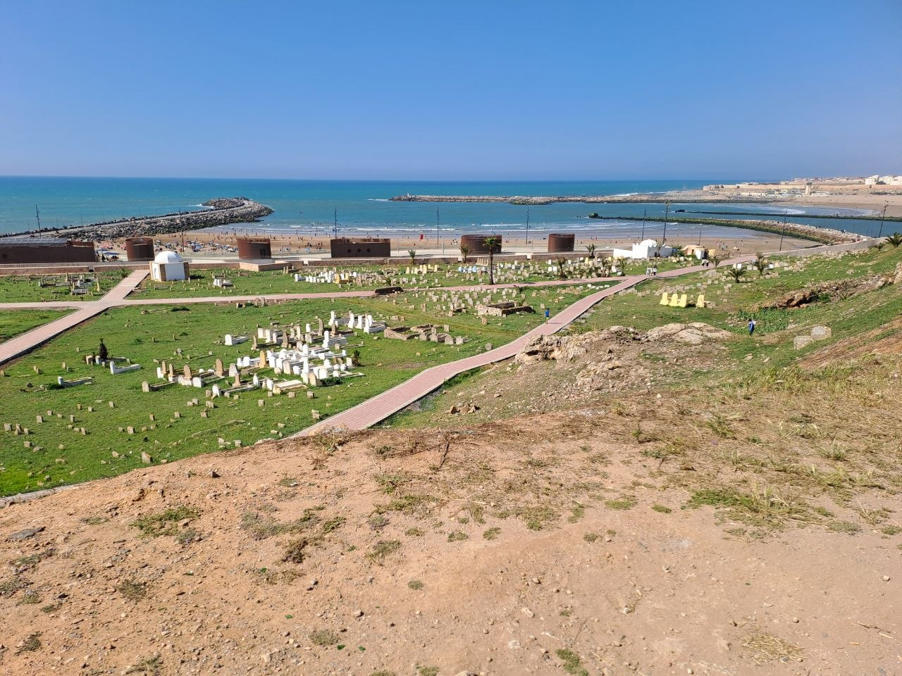
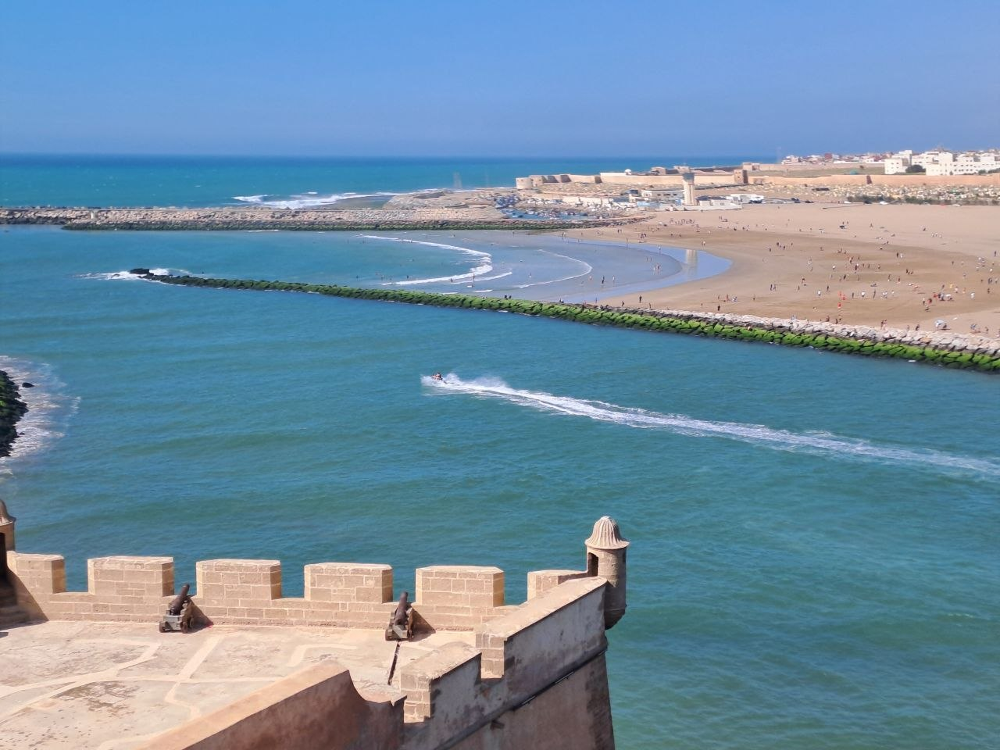

On April 25th, a group of seven motorcyclists, including the narrator, embarked on a leg of their Moroccan journey. The route took them from El Jadida, through the capital city of Rabat, and concluded for the day in Kenitra.

## A Challenging Ride to Rabat

The journey proved to be quite demanding, particularly as the group navigated through various inhabited centers. The roads themselves presented challenges, with many being uneven and rugged, especially outside the cities where significant heavy vehicle traffic added to the complexity. Upon reaching Rabat, the group paused for approximately three hours, taking the opportunity to explore the city's highlights.

## Rabat: A City of Order and History

Rabat left a distinct impression as a surprisingly modern and orderly city, offering a clean and organized contrast to some of the more chaotic, albeit vibrant, urban centers previously encountered. While acknowledging Rabat's unique appeal, the narrator noted that Marrakesh and Fes remained their personal favorites among Moroccan cities.

During their stop, the motorcyclists toured Rabat's historic Medina, a bustling marketplace, and managed to catch a glimpse of the Atlantic Ocean. Rabat, a UNESCO World Heritage site, boasts significant historical and cultural landmarks such as the Kasbah of the Udayas, a fortified kasbah with picturesque blue and white houses and Andalusian gardens, and the iconic Hassan Tower, an unfinished minaret of an ancient mosque. Adjacent to the tower is the striking Mausoleum of Mohammed V, a testament to modern Moroccan architecture.

## Onward to Kenitra

Following their exploration of Rabat, the group continued their ride, ultimately arriving in Kenitra, where they planned to clean up and further explore the city. Kenitra, historically known as Port Lyautey during the French Protectorate, is an important port city situated in a fertile agricultural region. It offers a blend of historical sites, such as the nearby Kasbah Mahdia, and natural attractions like Lake Sidi Boughaba, a significant wetland reserve.

## Moroccan Traffic: A Unique Experience

A recurring theme throughout the journey was the unique and often disorganized nature of Moroccan traffic. Beyond the heavy vehicles and uneven roads outside cities, the urban centers presented an

