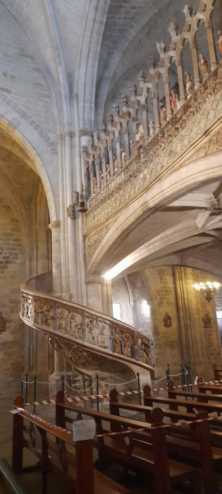
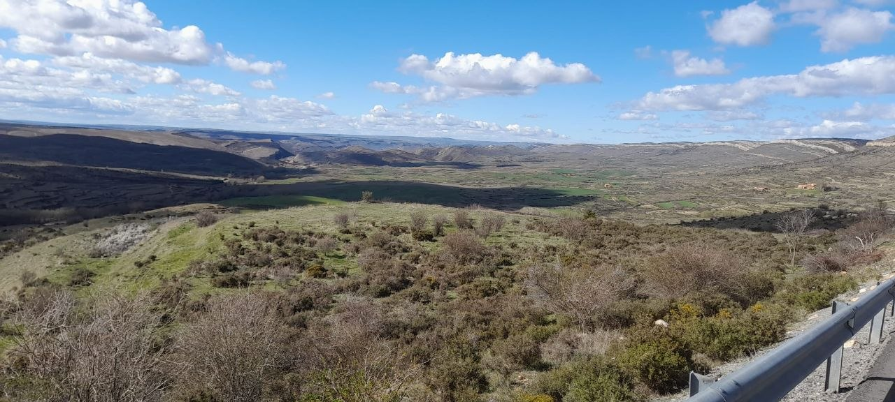
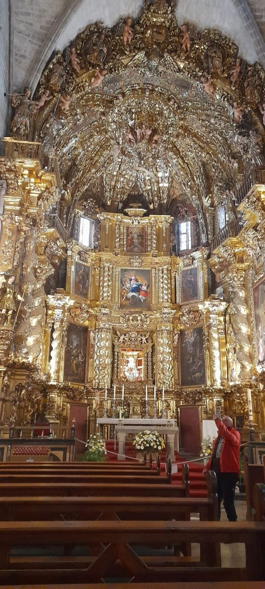
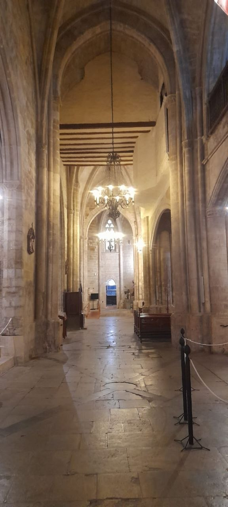
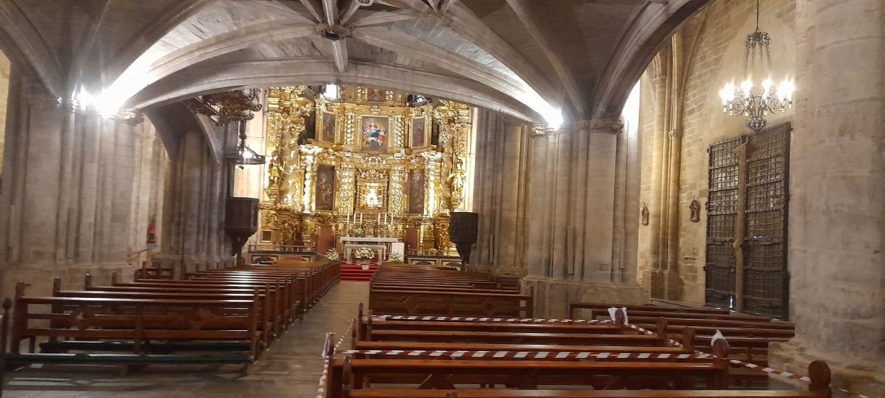
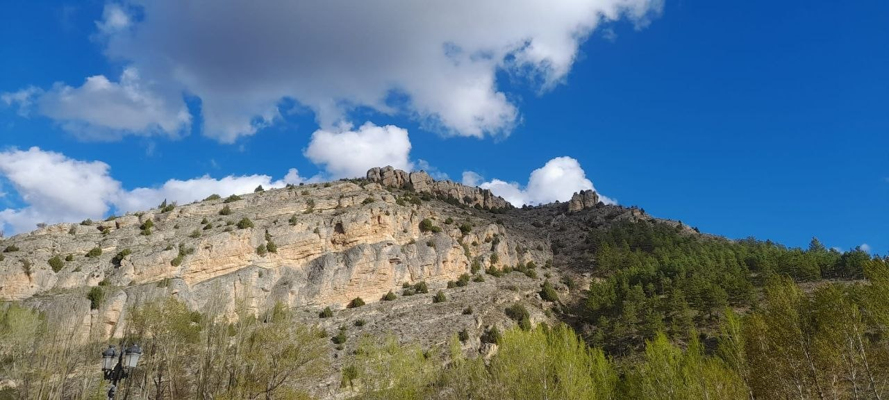
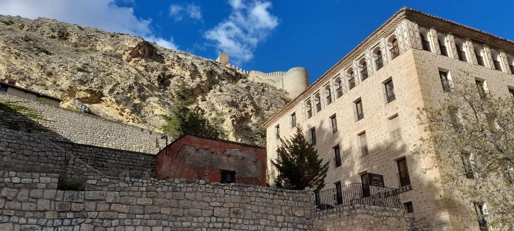
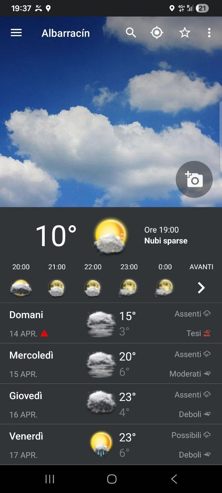
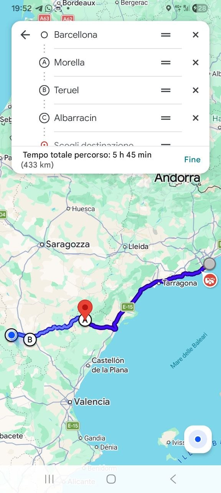

On April 13th, our motorcycle journey through Spain commenced with the first Spanish stage of our tour. Accompanied by my friends Bicio, Pacchio, Enrico, and Pasquale, we set out to explore the Spanish landscape by bike. This initial leg took us from Barcelona, heading towards the distinctive village of Albarracín, with a significant stop along the way.

## From Barcelona to Morella

Our first major stop after departing Barcelona was the town of Morella. This destination quickly proved to be a beautiful, likely medieval village, distinguished by a truly splendid cathedral. The architectural grandeur and historical feel of Morella provided a memorable pause in our journey.

## Onward to Albarracín

After exploring Morella, we resumed our ride, heading towards Albarracín, our planned stop for the night. The route continued to impress, and Albarracín itself lived up to its reputation as a very characteristic and engaging village where we settled for the evening.

## The Journey and Landscapes

The motorcycle ride between these destinations was exceptional. We experienced a beautiful and wonderful road, characterized by very fast curves stretching for hundreds of kilometers. This particular itinerary is, in my opinion, formidable and not to be missed by any motorcyclist. The landscapes encountered along the way were breathtaking, adding to the overall excitement of the ride.

## Safety Considerations on the Road

While the roads offer an exhilarating experience, it is crucial to exercise caution. It is easy to find oneself exceeding speeds of 120 km/h, despite the posted limits typically ranging from 80 to 90 km/h. We also noted a significant presence of speed cameras (Autovelox) throughout the region, underscoring the importance of adhering to speed regulations. Constant vigilance is necessary to ensure a safe journey.

Overall, this first Spanish stage was very beautiful and exciting, with landscapes that truly captured our attention. It comes highly recommended for fellow riders seeking an engaging and scenic route.

