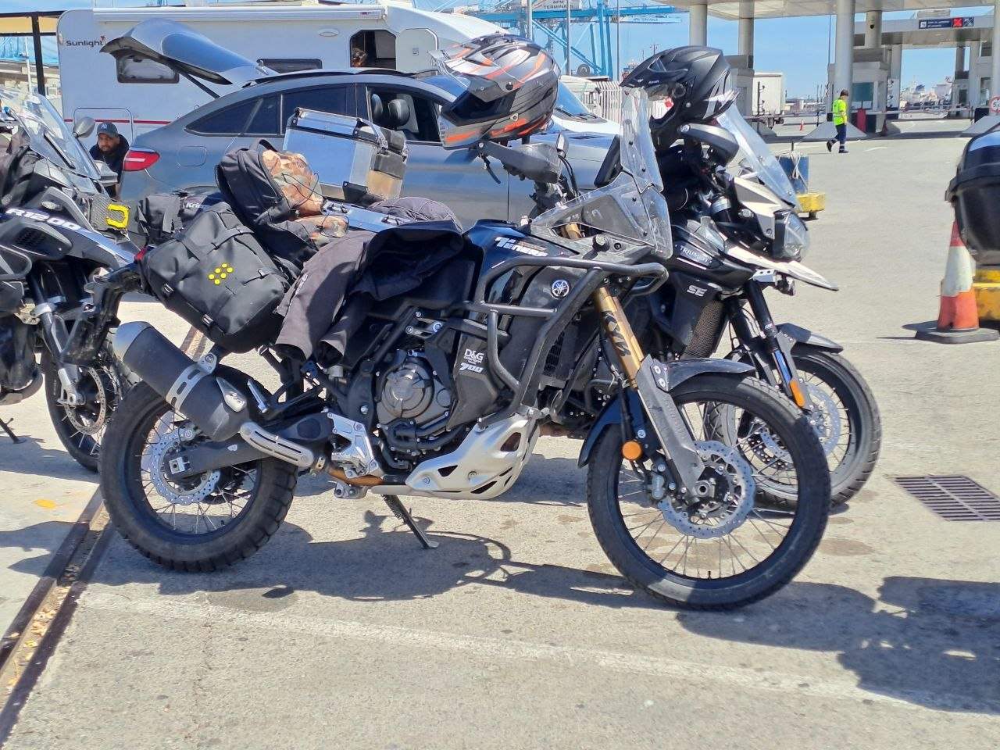
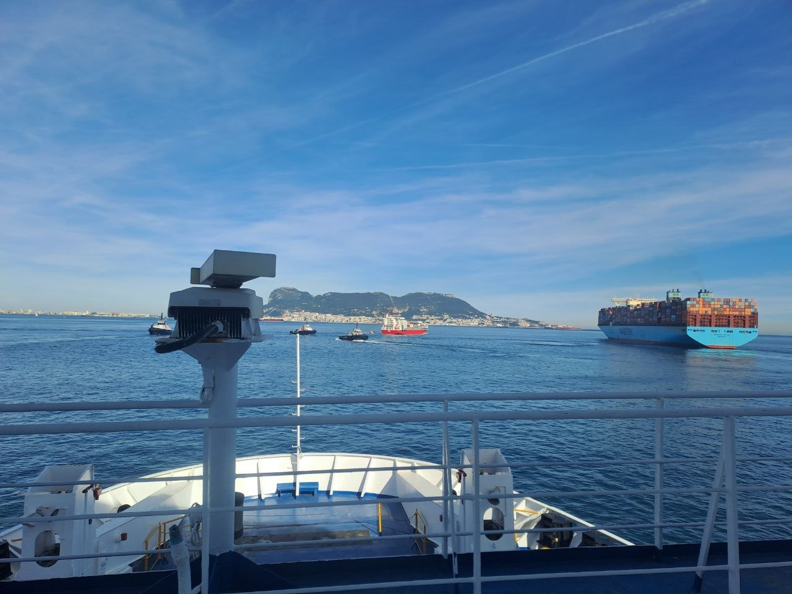
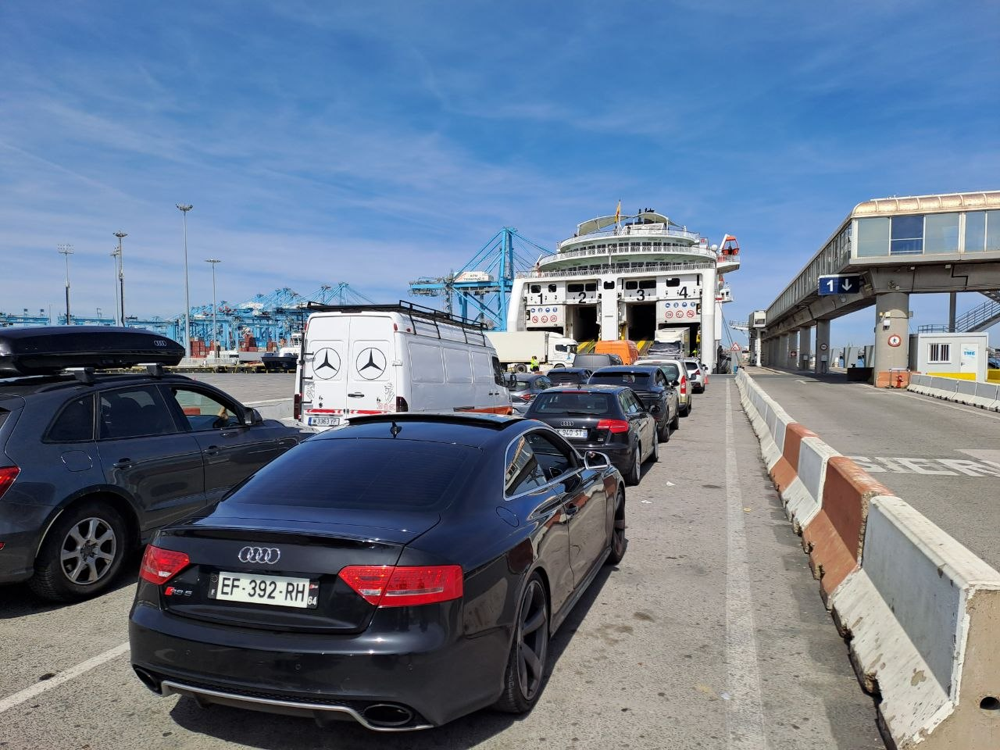
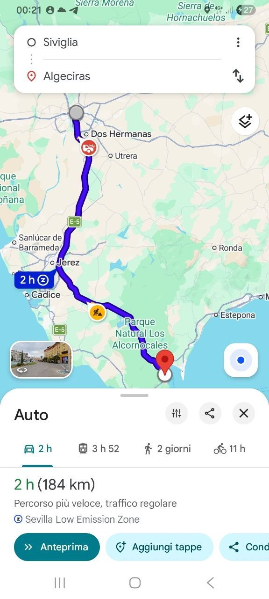
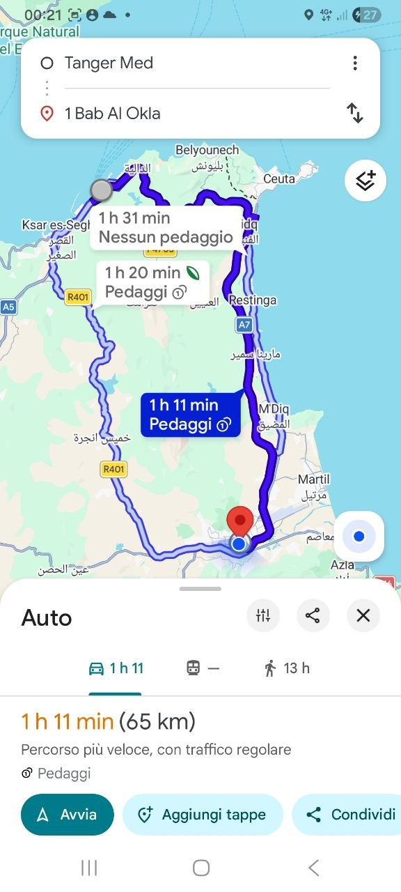

On April 16, our motorcycle journey took us from Seville, Spain, across the Strait of Gibraltar to Tetouan, Morocco. This day was primarily a transfer leg, essential for our continued route, though it presented its own set of challenges.

## The Journey Commences: Delays and Port Procedures

The day began with an unexpected hurdle as our ferry from Spain departed with a two-hour delay. This significant wait at the port set the tone for a long day. Once we reached Tanger Med, further delays ensued as we navigated the necessary bureaucratic procedures for entry into Morocco. These steps added considerable time to our schedule.

## The Strait Crossing and Arrival in Morocco

Our ferry crossing, handled by the Spanish company Baleària, proved to be a notable disappointment. Despite expectations of a smooth journey, the waiting times associated with their service were exceptionally long. We had anticipated a more efficient experience, but the reality was quite different. The view from the ferry provided a glimpse of the vastness of the Strait and the surrounding landmasses.

## Riding into the Night towards Tetouan

After disembarking and clearing customs at Tanger Med, the final leg of our journey to Tetouan involved riding for over an hour in the dark and cold. This section required focused attention given the conditions. Upon arrival in Tetouan, finding our accommodation in the Medina also presented difficulties; what was described as a Riad turned out to be something different, requiring a prolonged search to locate it.

## Our Riding Group

This demanding transfer day was undertaken by our usual group. The team includes myself, Bicio, Pacchio, Enrico, and Pasquale. We collectively experienced the frustrations and challenges of the day, which, despite being tiring, was a necessary step in our travel plan.

