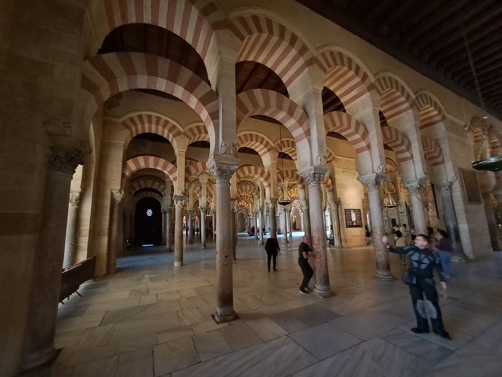
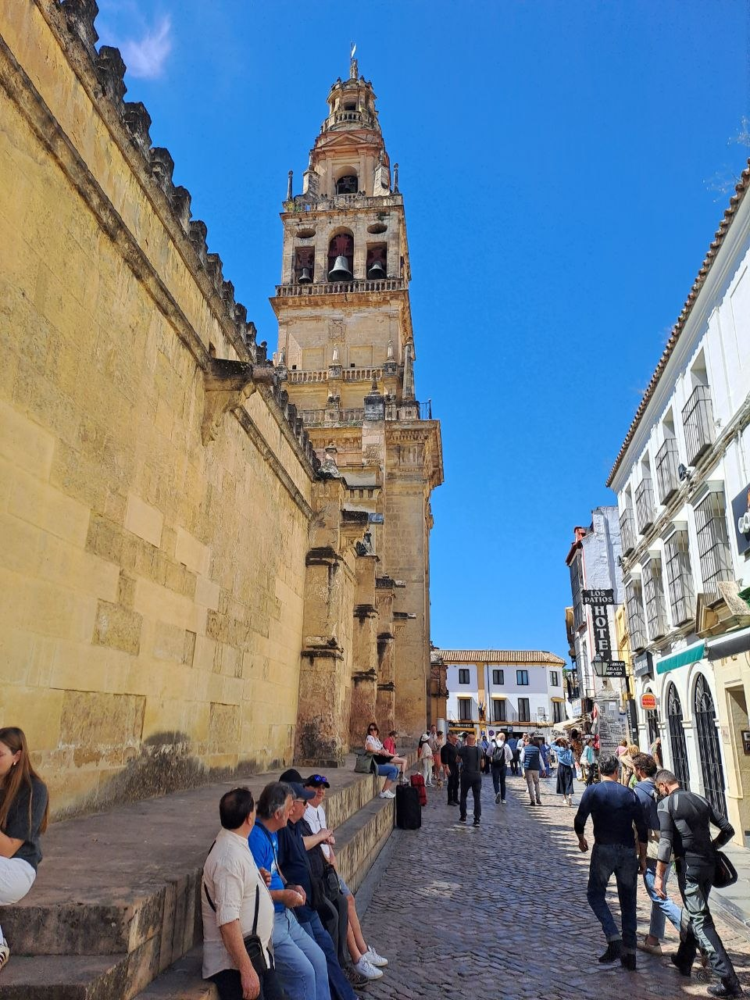
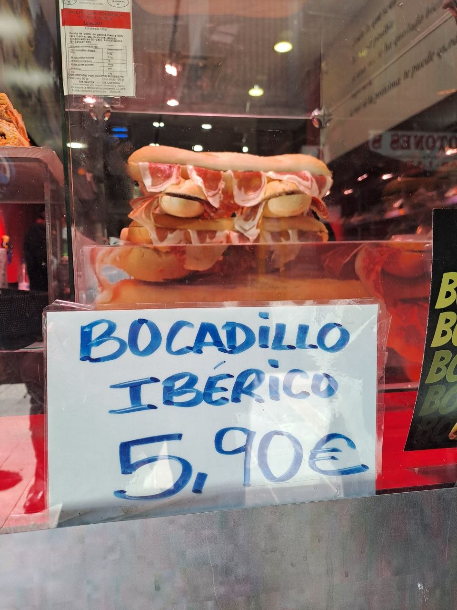
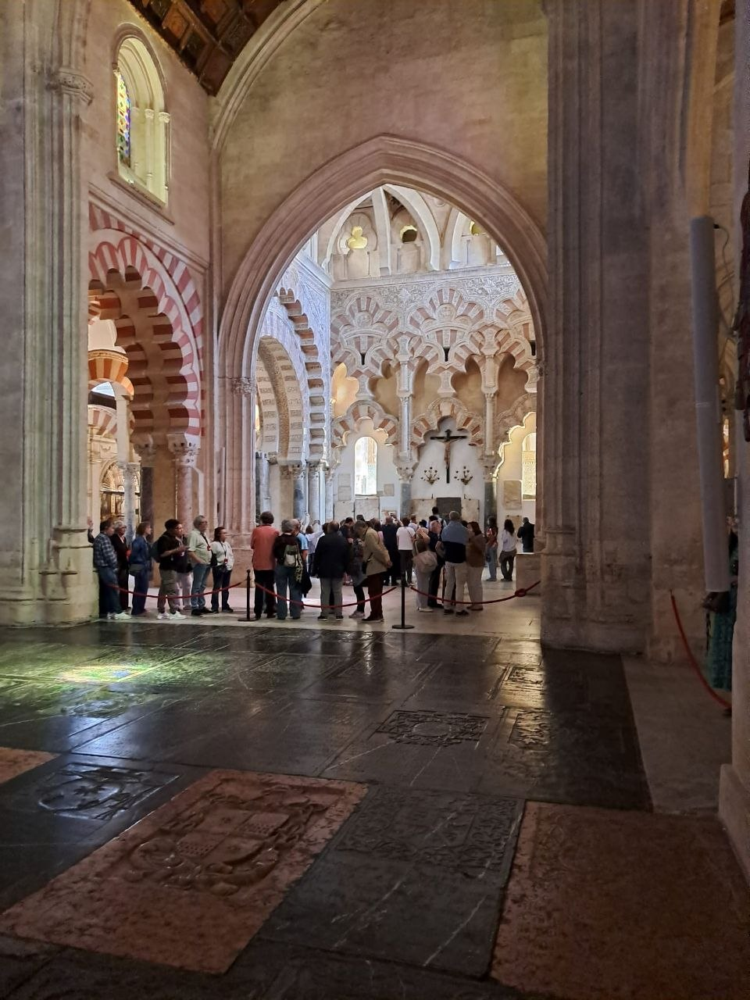
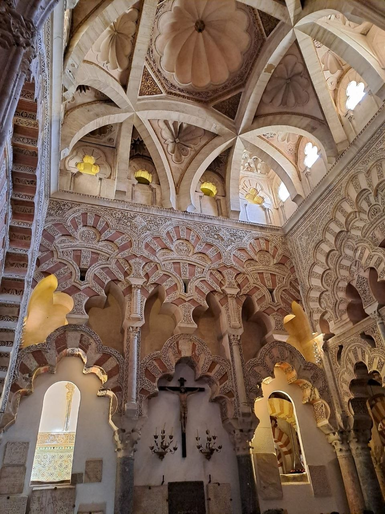
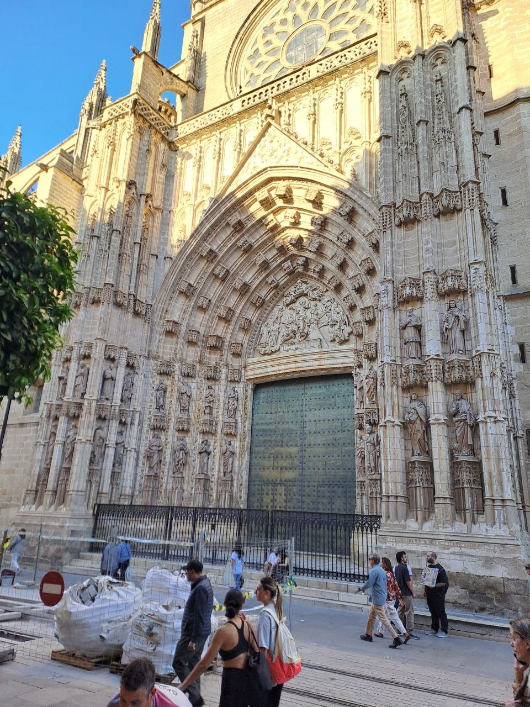
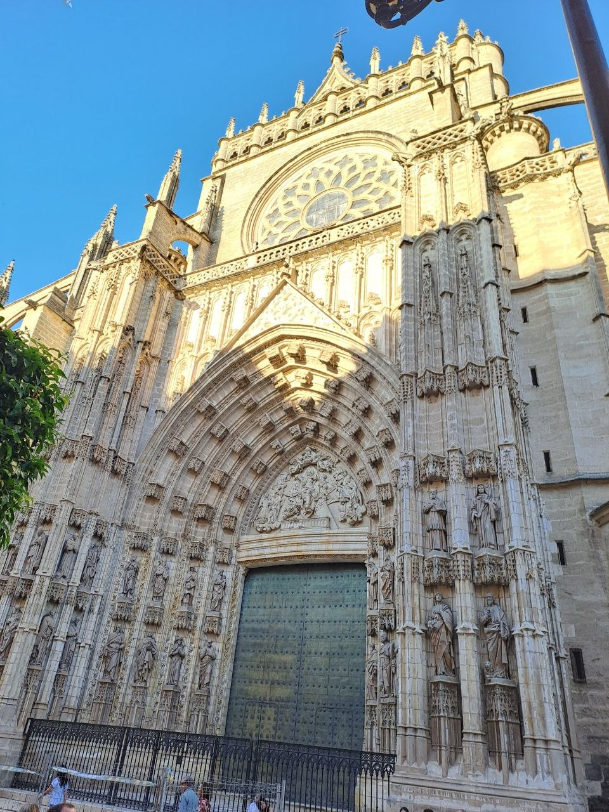
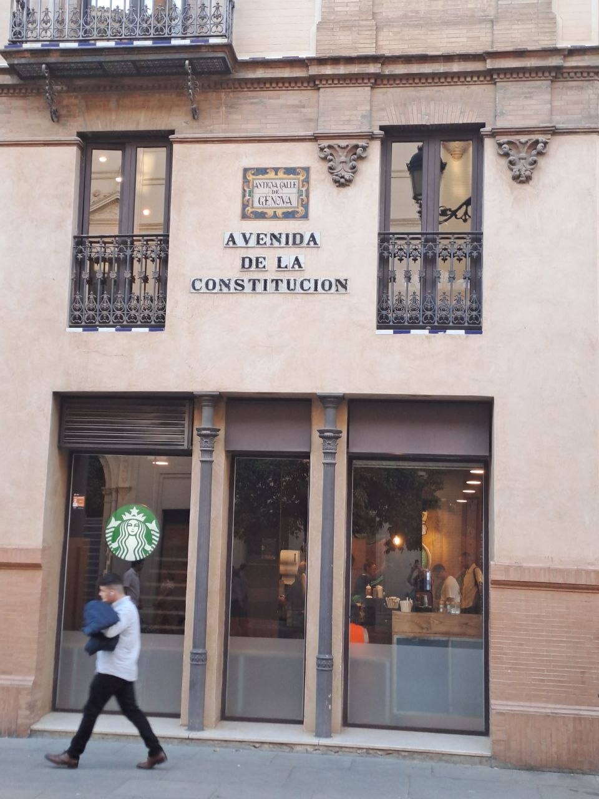
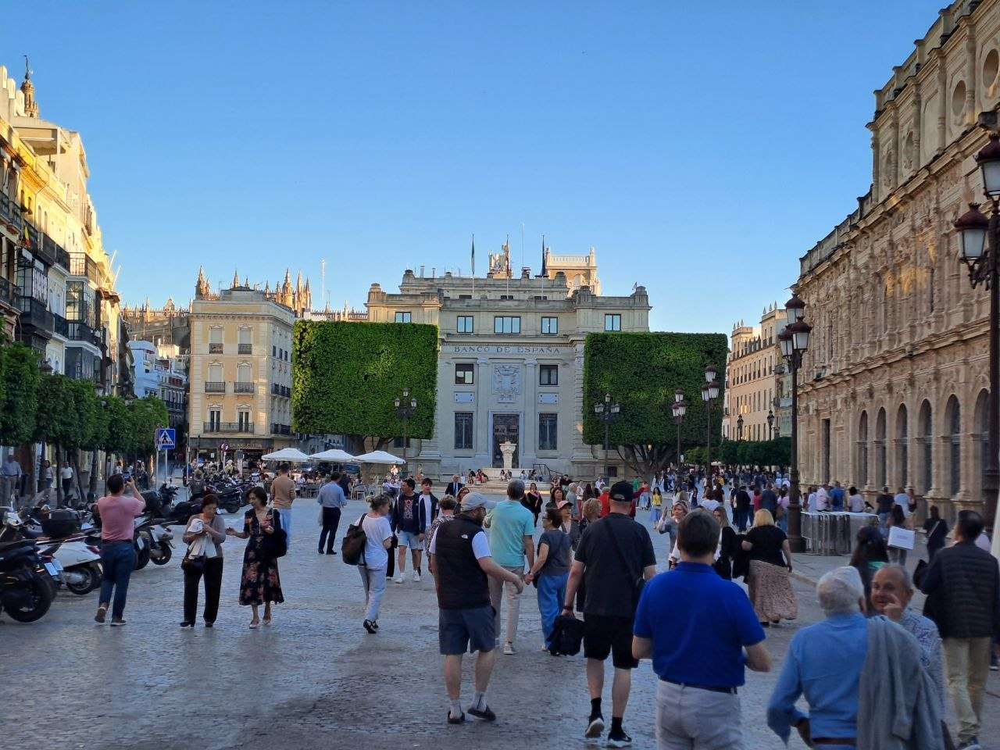
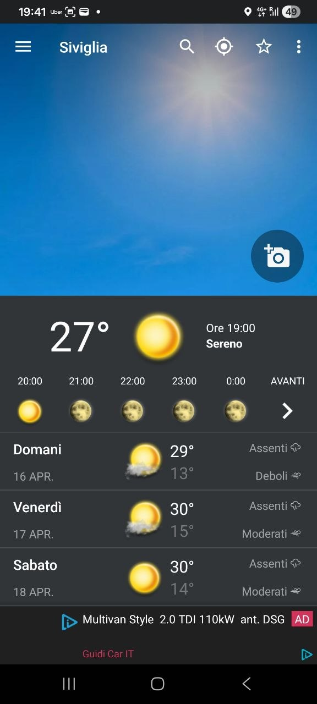

Our latest motorcycle adventure brought us from Úbeda, a city rich in history, on a journey across the diverse landscapes of Andalusia. This leg of the tour, a blend of efficient travel and cultural stops, set the stage for our continued exploration.

## Journey through Andalusia: Úbeda to Seville

Today's leg of our journey began in Úbeda, setting out on a route that would take us across a significant portion of Andalusia. The ride was largely straightforward, primarily utilizing auto-routes. While these sections offered efficient travel, they presented fewer opportunities for the winding roads and scenic exploration we typically seek on our tours. A practical note for fellow riders: we observed a notable presence of speed cameras along these routes, a detail worth keeping in mind for maintaining an enjoyable and compliant pace.

## A Stop in Cordoba

Midway through our day, we made a planned stop in Cordoba. This city offered a perfect break for lunch and some cultural immersion. We refueled with an excellent 'bocadillo con jamón', a local culinary highlight that was both satisfying and authentic. Cordoba's rich history is palpable, and while our stop was brief, the opportunity to witness its unique architectural heritage, particularly the intricate designs evident in its historic core, was a welcome diversion before continuing our ride.

## Arriving in Seville

Our afternoon ride concluded as we approached Seville. The weather transitioned significantly throughout the day; what started as a cool morning became quite warm by the afternoon, with temperatures reaching approximately 30 degrees Celsius as we neared our destination. This shift underscores the importance of layered clothing and proper hydration when touring in this region. In Seville, we settled in for the evening, enjoying the city's vibrant atmosphere. The spirited local life provided a lively backdrop to our night, offering a taste of Andalusian culture beyond the saddle. The city's grand landmarks provided impressive backdrops to our evening stroll.

## Looking Ahead: Spain to Morocco

This journey through Andalusia has been a compelling chapter. Looking ahead, our next major transition awaits: tomorrow, we prepare to cross from Spain into Morocco, marking a significant milestone in our motorcycle expedition.

