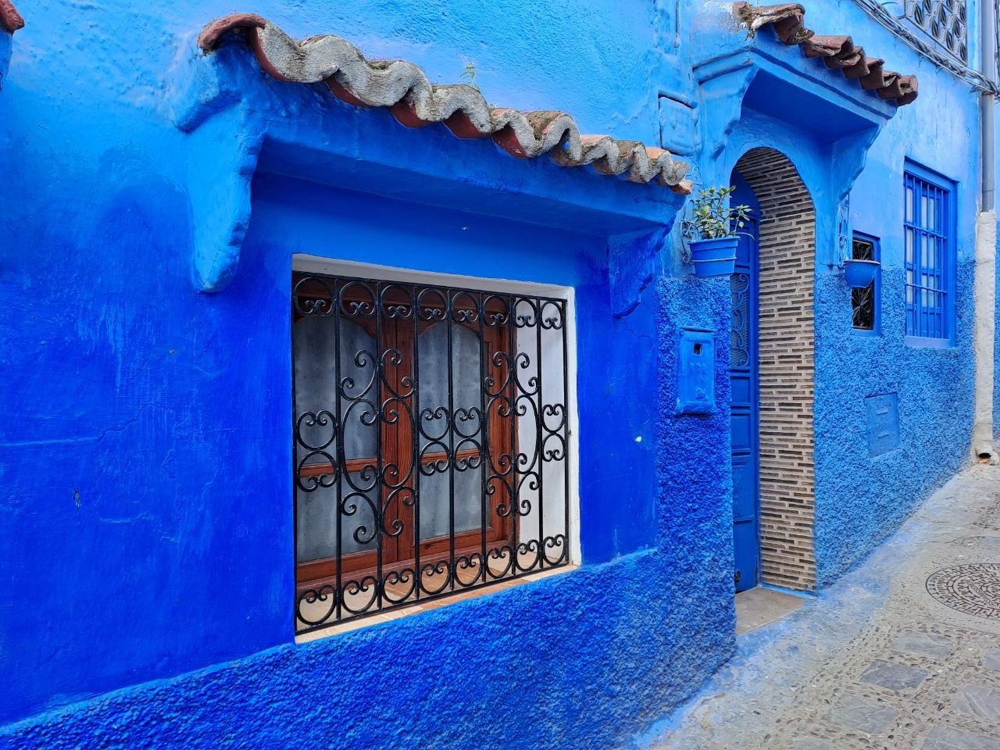
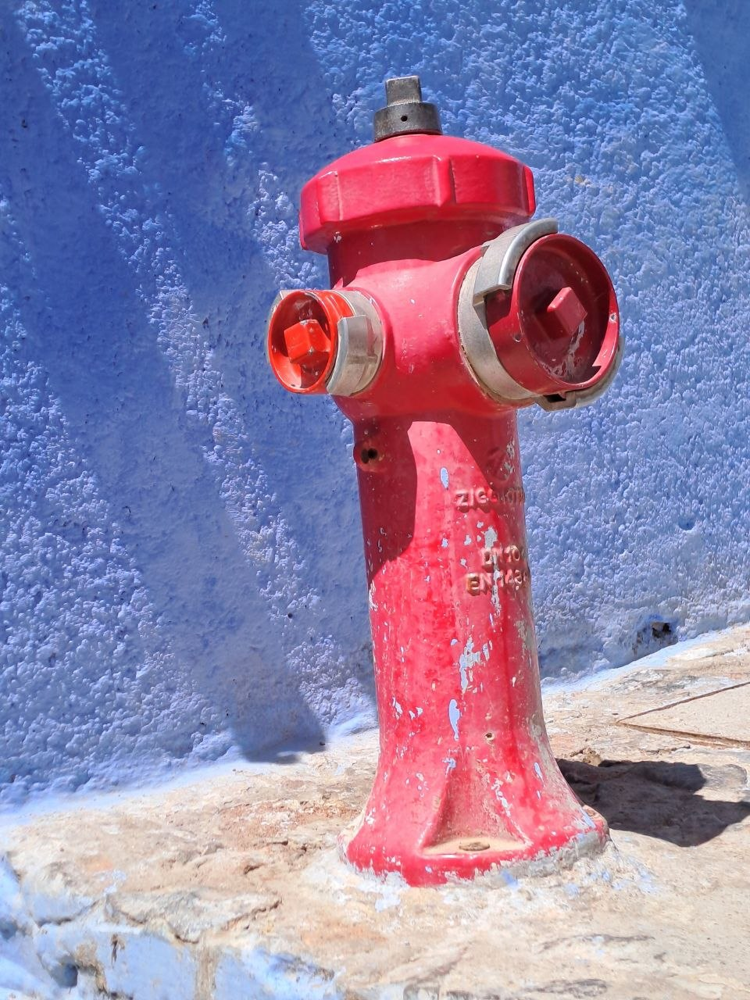
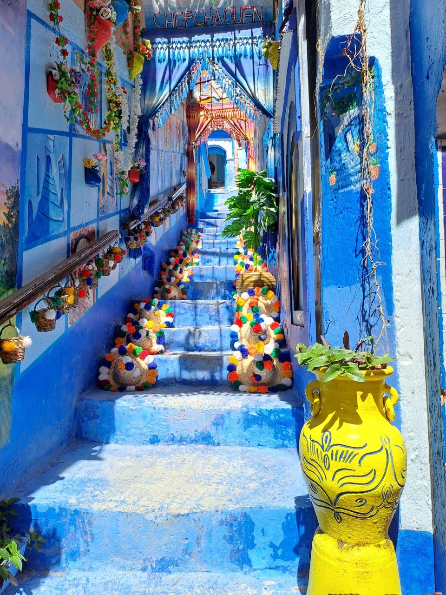
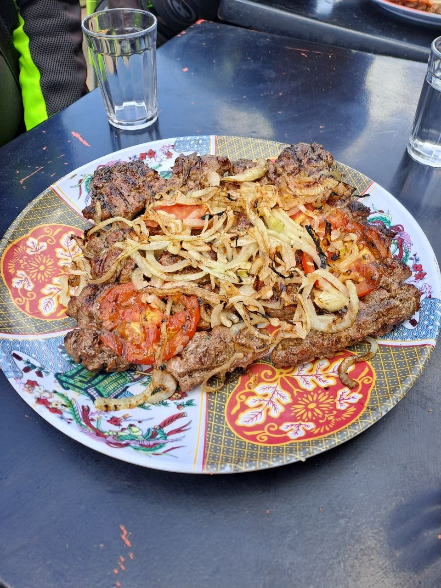
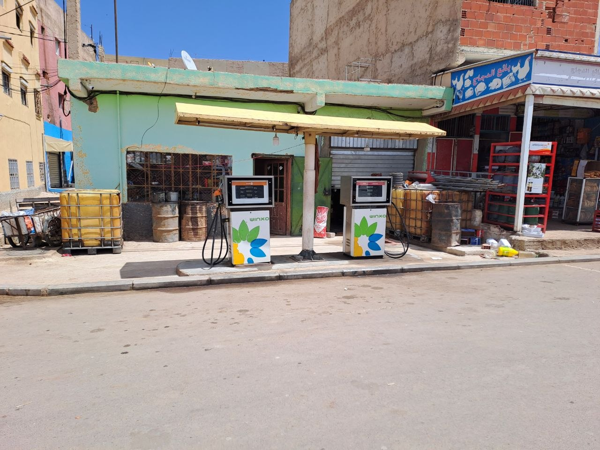
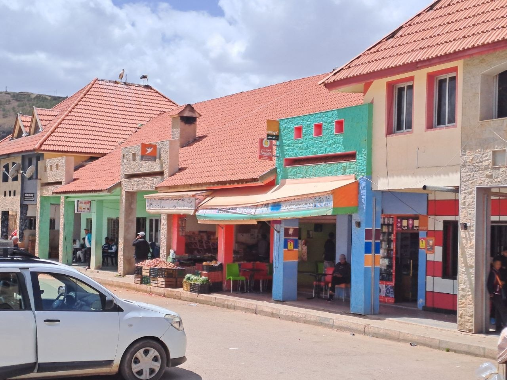
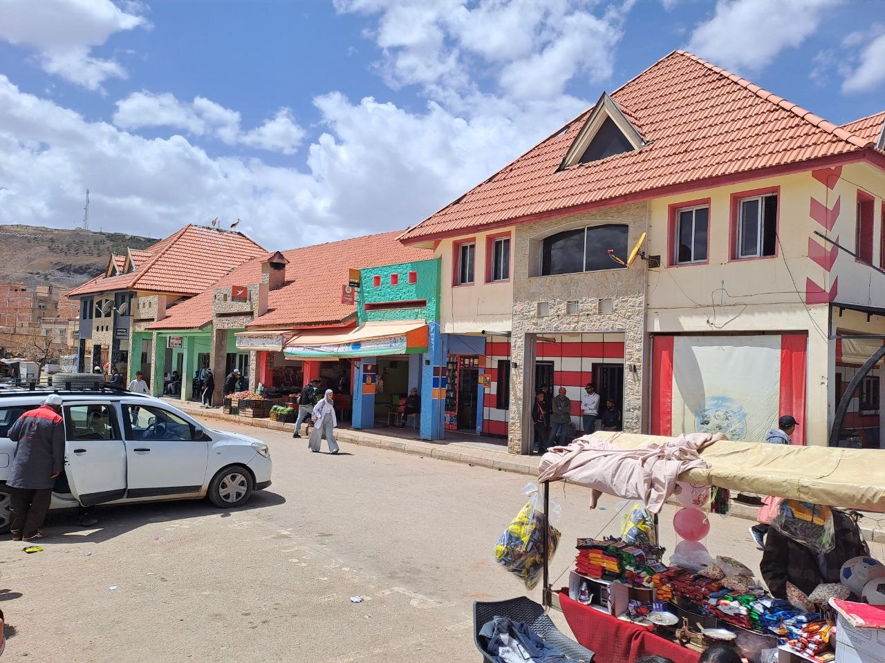
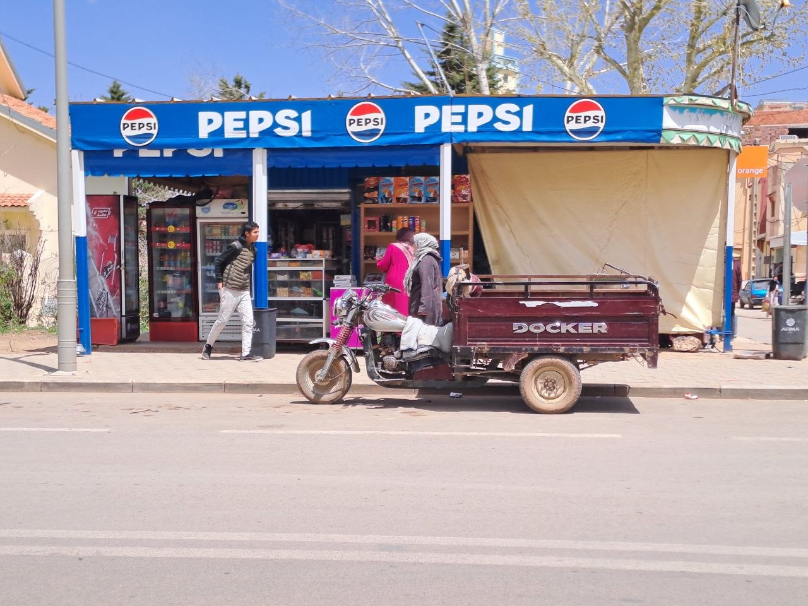
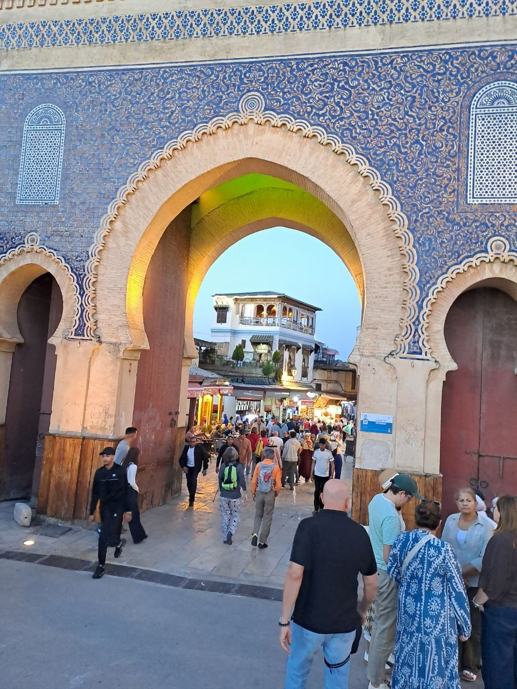

On April 17, our group of motorcyclists departed from Tetouan, embarking on a route that would take us towards Chefchaouen. This leg of our journey was the beginning of an immersive experience in Morocco's northern regions.

## Chefchaouen: The Blue City

Upon arriving in Chefchaouen, we dedicated time to explore the city, taking in its distinctive characteristics and landscapes. The city is renowned for its striking blue-painted buildings, a feature that makes it instantly recognizable and a highlight for visitors. We took numerous photographs, capturing the unique aesthetic of the city's alleys and architecture.

Chefchaouen's history is as rich as its visual appeal. It was founded in 1471 by Moulay Ali ibn Rashid al-Alami, initially as a fortress to defend against Portuguese invaders. The tradition of painting the city blue is largely attributed to Jewish refugees who settled there in the 1930s. They brought with them the custom of painting buildings in various shades of blue, a color often associated with the sky and spiritual significance.

## A Brief Stop in Fes

In the afternoon, after our time in Chefchaouen, we continued our ride towards Fes. Our arrival in Fes allowed for a brief tour of its historic Medina. While we made a quick stop to experience this ancient urban center, the short duration of our visit meant we were unable to fully appreciate the intricate labyrinth of its alleys, traditional shops, and the many particular details that define the Medina of Fes.

## Continuing the Journey from Fes

Our route took us to Fes, a central hub for further exploration into the diverse landscapes of Morocco. For those continuing their motorcycle journey southward from Fes, a common route often includes stops in Ifrane, Azrou, and Midelt. This segment typically covers approximately 207 kilometers and can take around 3 hours and 37 minutes, offering a continuation of Morocco's varied scenery and cultural experiences.

Our focus on this part of the trip was primarily on Chefchaouen, allowing us to delve into the atmosphere of the blue city before moving on to other destinations.

