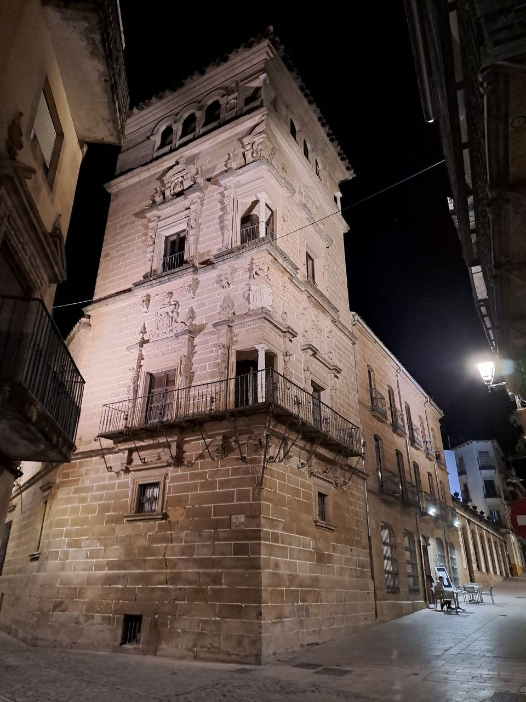
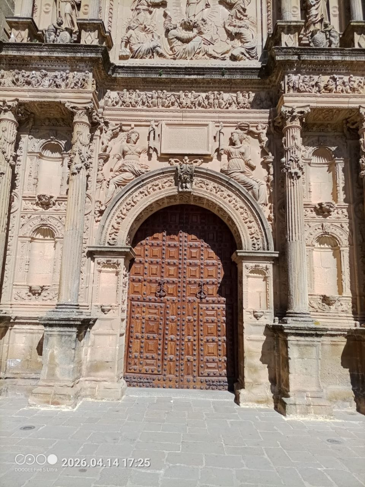
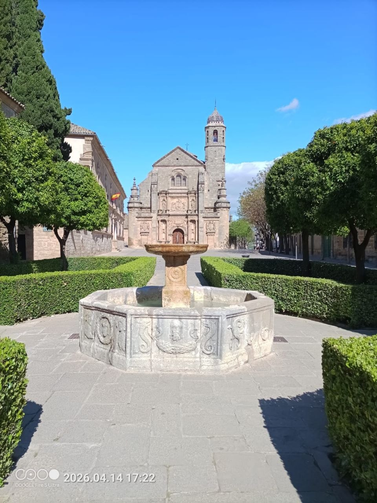
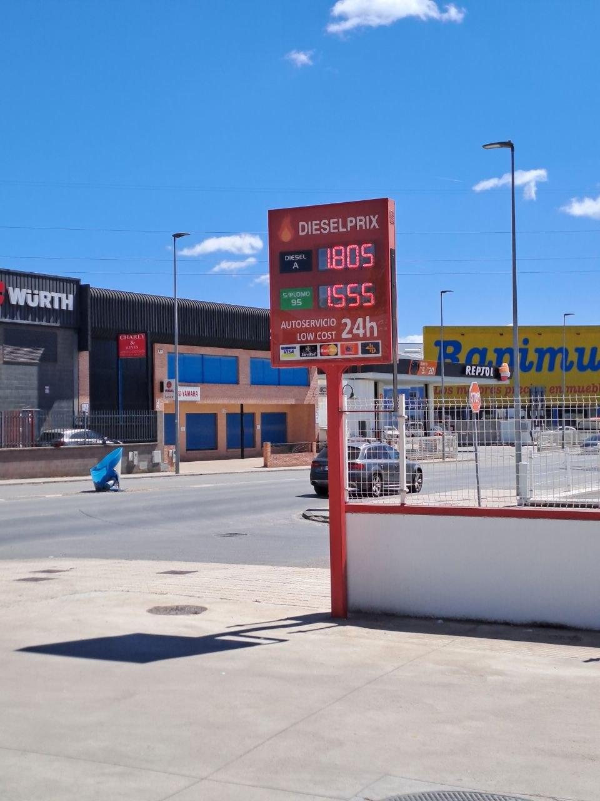
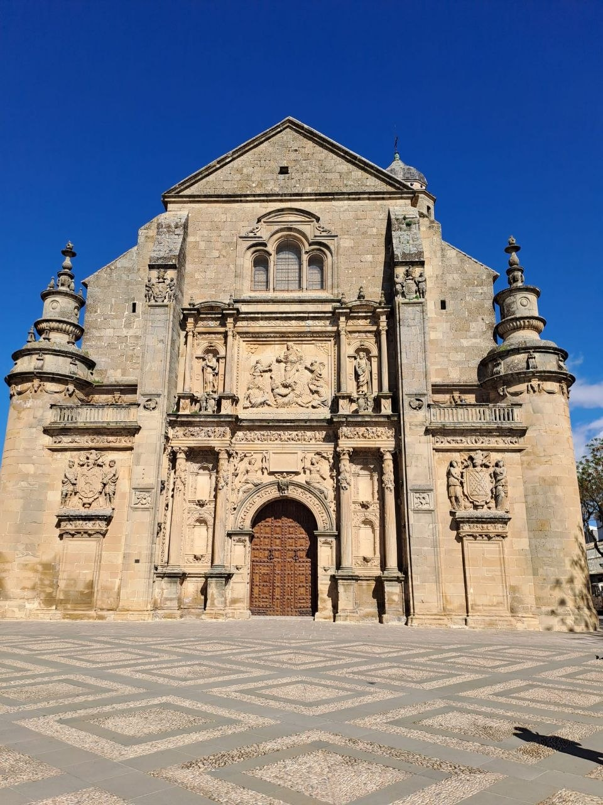
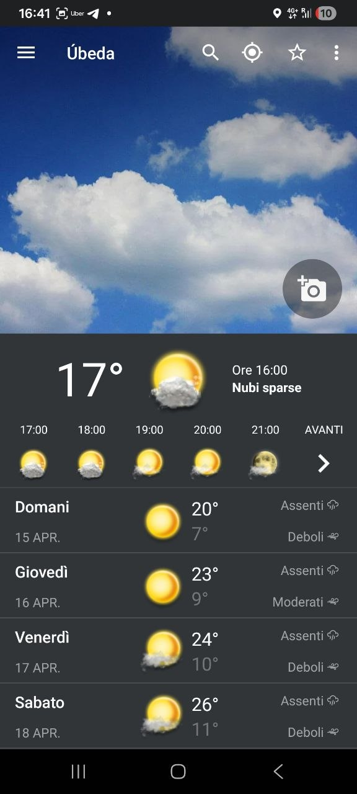
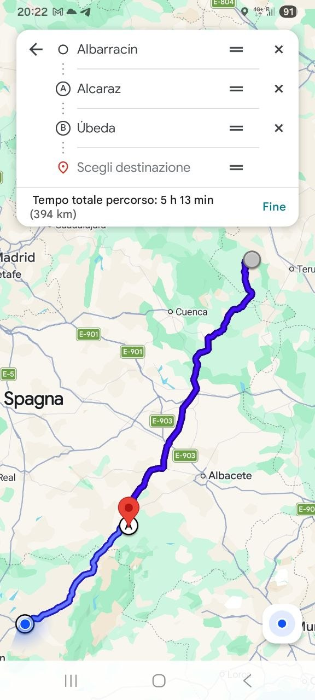

Today, April 14th, marked our second day riding motorcycles in Spain with four friends. The journey took us from Albarracín, through a brief stop in Alcaraz, and concluded in Úbeda.

## Our Route Through Spain

Our day began in Albarracín, a historic town that served as our starting point. From there, we made our way south, covering a significant portion of Spain's varied landscape. We took a brief stop in Alcaraz before continuing our ride to Úbeda, our final destination for the day. This segment of our trip covered approximately 394 kilometers, a challenging yet rewarding distance for a day's ride.

## Road Conditions and Scenery

One of the most striking aspects of today's ride was the quality of the roads. They were in excellent condition, and we encountered virtually no traffic. This allowed for a smooth and enjoyable experience, giving us the freedom to ride at a comfortable pace. The landscapes we traversed were truly breathtaking. We were particularly impressed by the vast stretches of olive groves that dominated the scenery between Alcaraz and Úbeda. These expansive, cultivated fields of olive trees created a unique and memorable vista, covering hectares of terrain.

## Journey Details

By the end of the day, we had completed nearly 400 kilometers, a figure consistent with our travel yesterday, which saw us cover almost 440 kilometers. The journey involved practical stops for fuel, ensuring our motorcycles were ready for the long distances. These daily distances highlight the immersive nature of our motorcycle tour, allowing us to experience a wide array of Spanish environments.

## Exploring Úbeda

Our arrival in Úbeda marked the end of another day on the road. This city, known for its historical architecture, provided a suitable conclusion to our ride. The weather in Úbeda, as observed upon our arrival, was pleasant with temperatures around 17 degrees Celsius and scattered clouds, offering favorable conditions for exploring the town.

