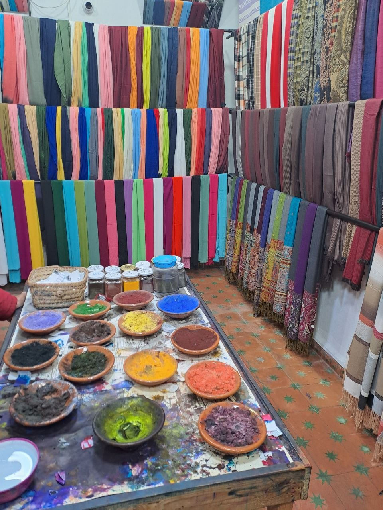
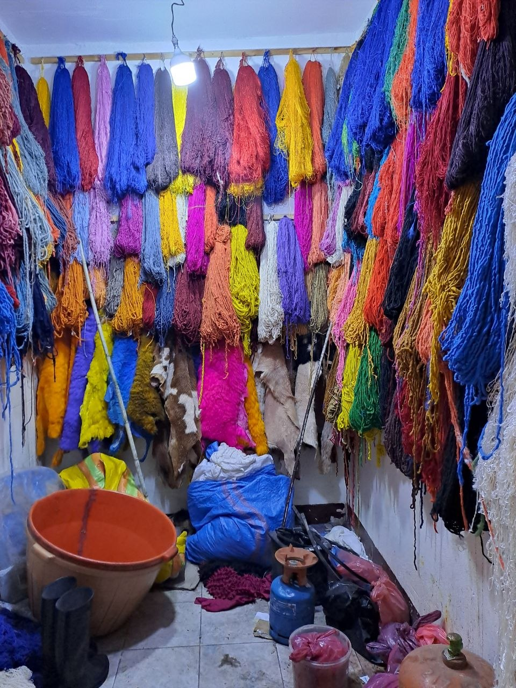
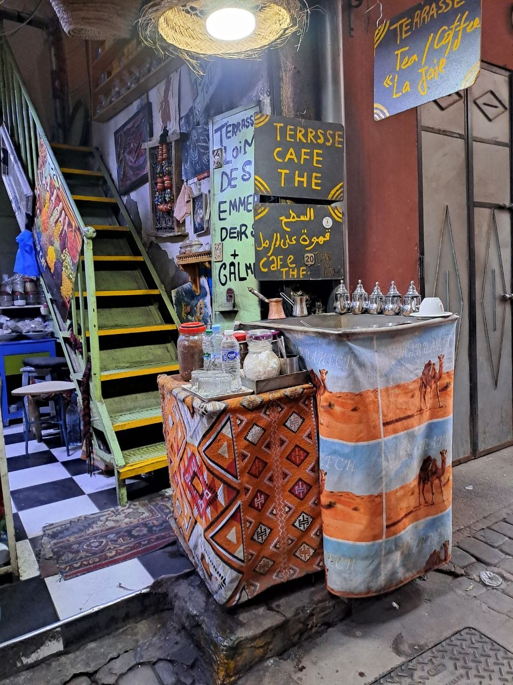
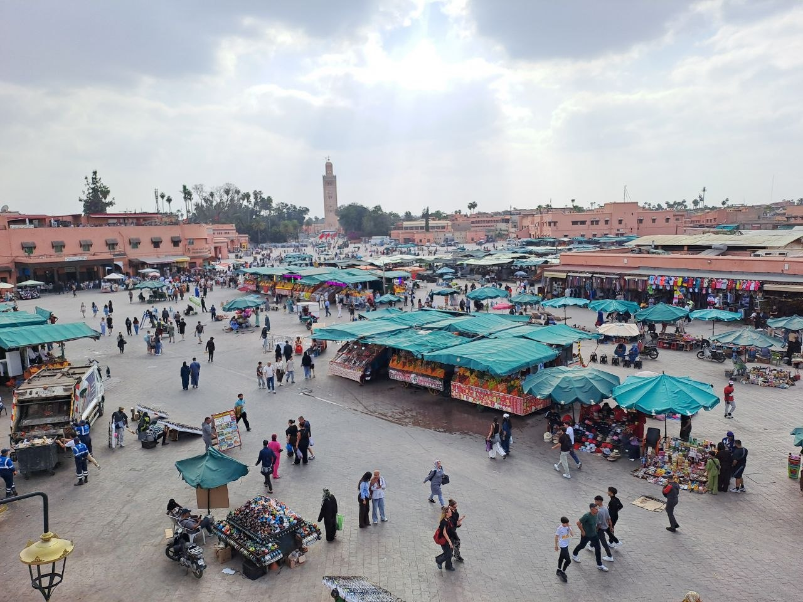

On April 24, our group of seven motorcyclists paused our journey in Marrakech for a day of rest and city exploration. This stop allowed us to immerse ourselves in the dynamic atmosphere of one of Morocco's most iconic cities.

## A Day of Exploration in Marrakech

Our day began with a deep dive into the labyrinthine alleyways of the Medina, where we spent hours wandering. The market was a focal point of our exploration, offering a glimpse into daily life and commerce. We enjoyed typical Moroccan and Berber cuisine, savoring the local flavors. The Medina's narrow streets provided ample opportunities for shopping, where we observed local artisans at work, with vibrant colors from natural dyes being prepared and used in various crafts. We encountered many friendly locals, which added to the enjoyment of our visit as we moved through the bustling environment of the city.

## Djemaa el-Fna: The Heart of the City

A highlight of our day was the main square, Djemaa el-Fna, the central hub of Marrakech. During the day, the square hummed with market activity and a steady flow of people. As evening approached, the square transformed, becoming even more lively and enchanting. This was a time when we met even more people, experiencing the energetic spirit of the square as locals and visitors alike converged. The atmosphere was vibrant, contributing to a memorable evening for our group.

## Marrakech: A Tapestry of History and Culture

Marrakech, often referred to as the "Red City," holds a significant place in Morocco's history and culture. It was founded around 1070 by the Almoravid dynasty and quickly rose to prominence, serving as the capital of the Almoravid Empire. Later, it became the capital of the Almohad Caliphate, solidifying its role as a major political, economic, and cultural center in North Africa. Its strategic location at the crossroads of trade routes between the Sahara and the Atlas Mountains allowed it to flourish, impacting the development of the entire country.

Today, Marrakech is a bustling metropolis with a population of over 1.3 million inhabitants. Its primary economic activities are deeply rooted in tourism, drawing visitors from around the globe to experience its rich heritage. Traditional crafts, such as leather goods, pottery, spices, and especially textiles, continue to thrive, showcasing the skills of local artisans. Trade also remains a vital component of the city's economy, with its historic markets still serving as key commercial centers.

