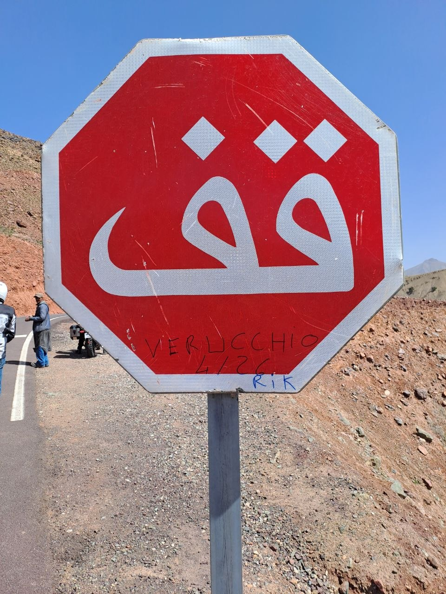
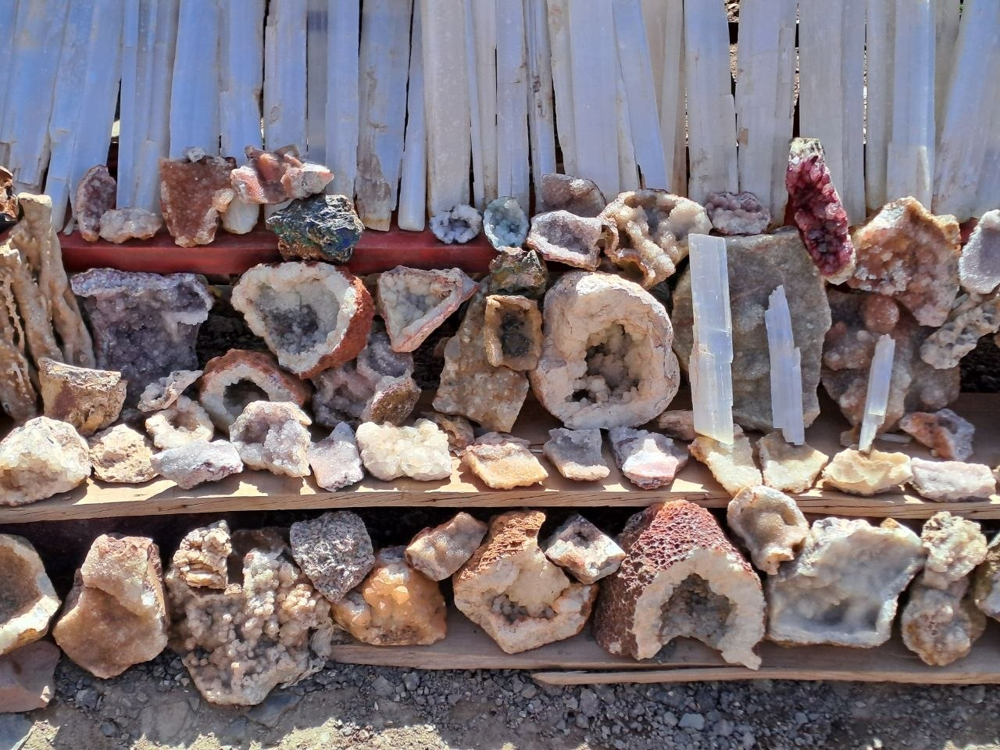
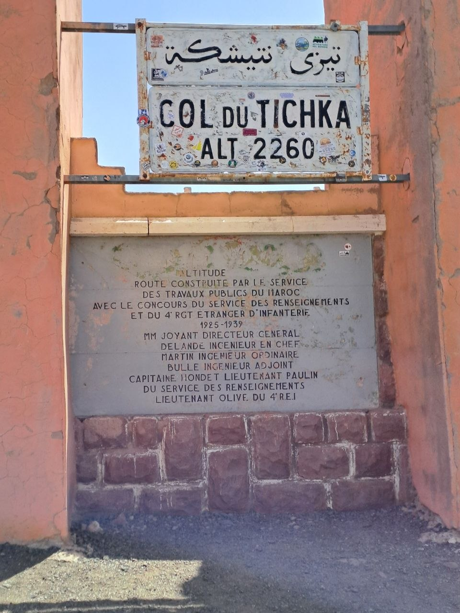
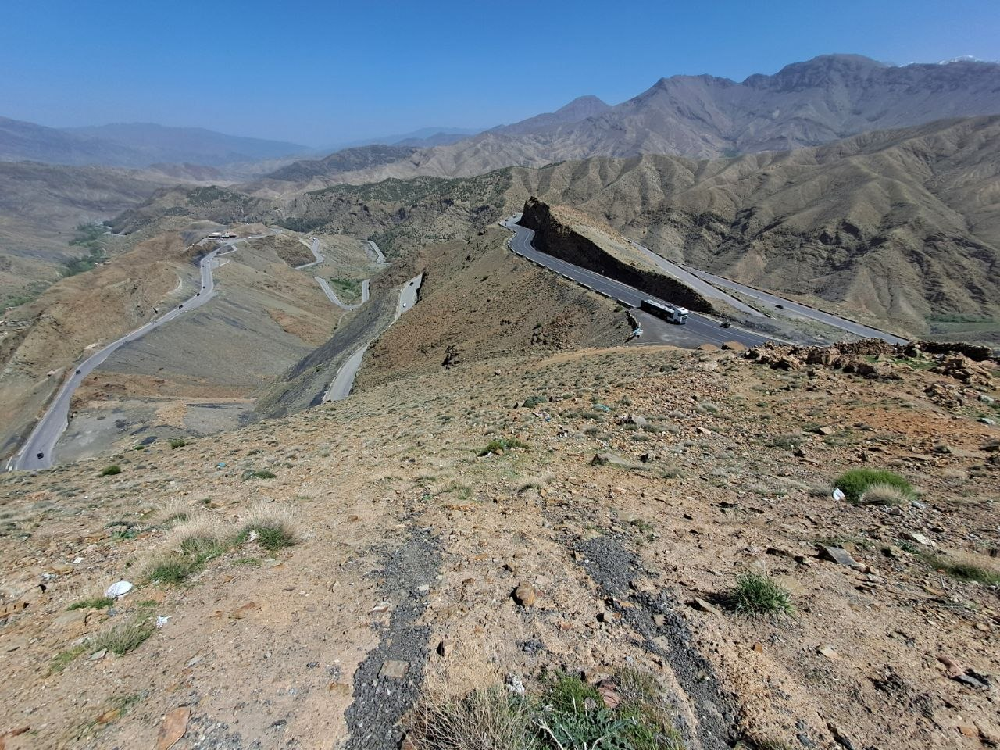
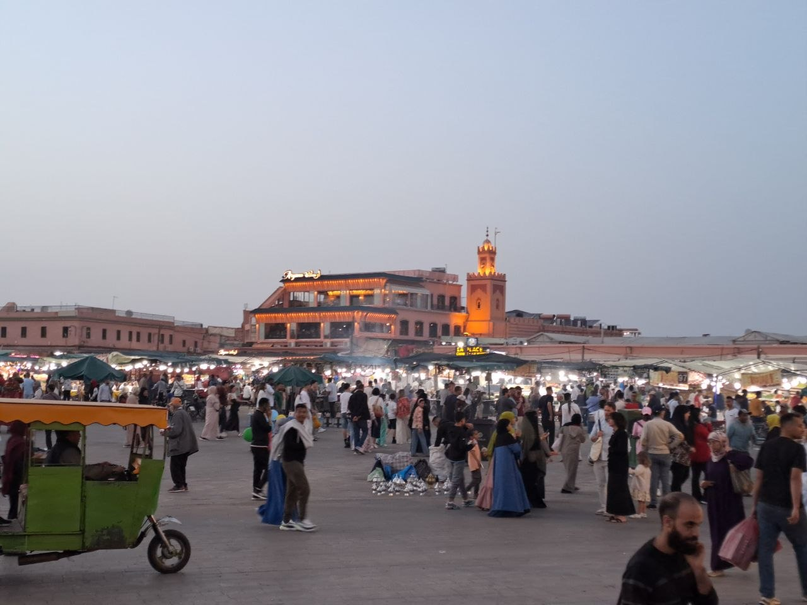
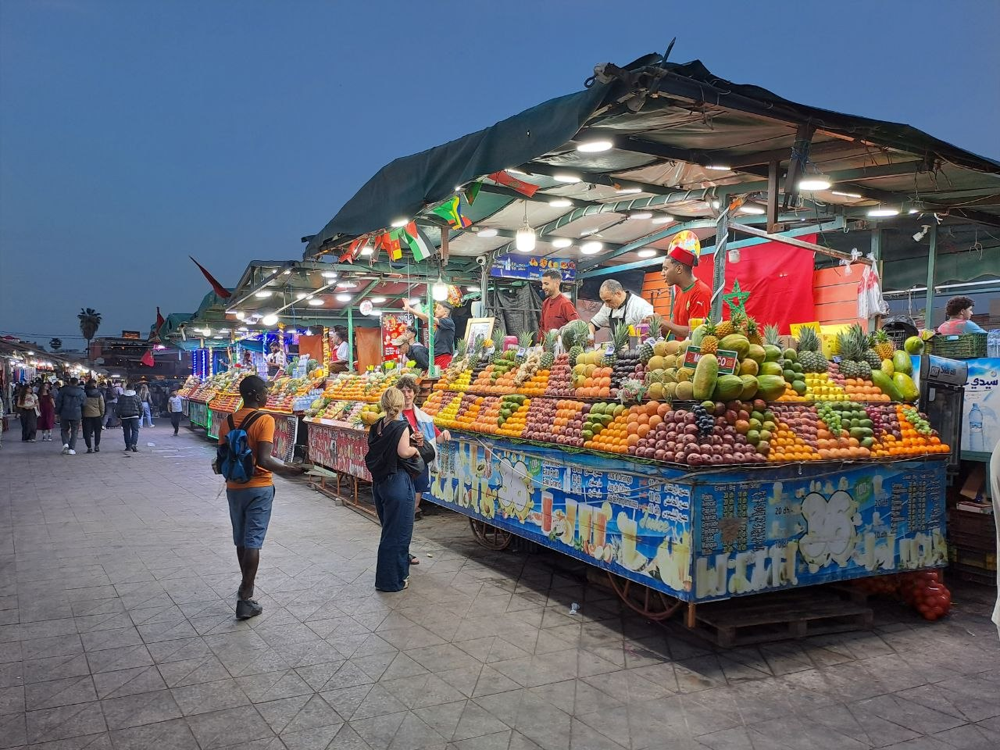
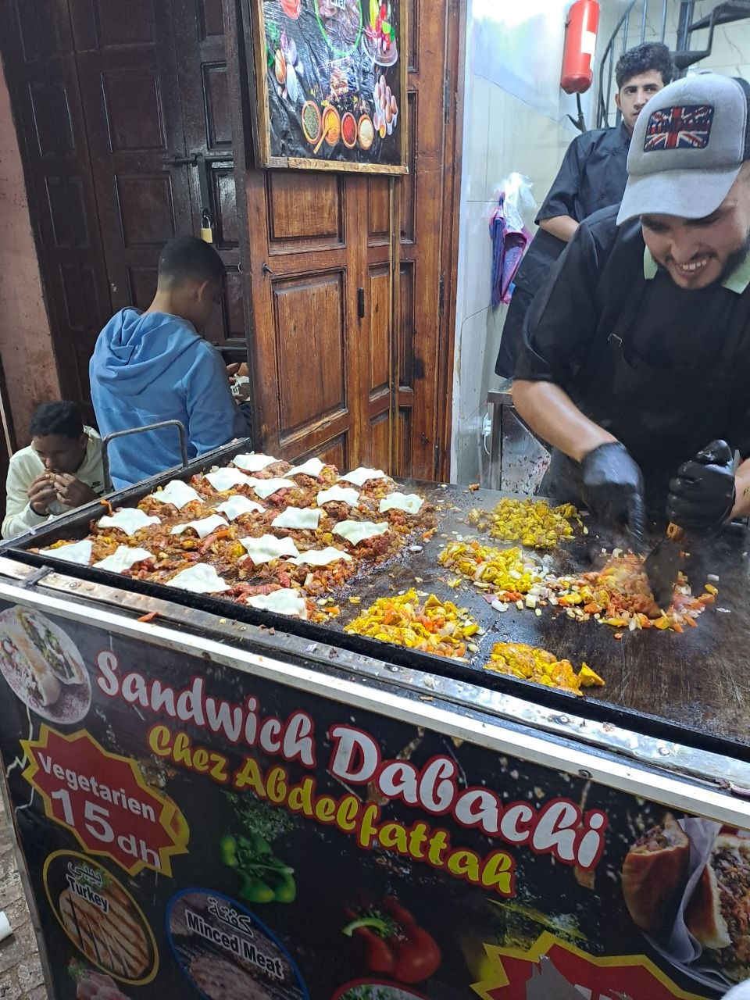

Today, we embarked on a motorcycle journey from Ait Benhaddou, heading north towards Marrakech. This leg of our trip promised both challenges and spectacular landscapes as we made our way through the Atlas Mountains.

## The Ascent to Tizi n'Tichka

Our route from Ait Benhaddou led us towards the Tizi n'Tichka Pass. This segment of the road proved to be a demanding mountain passage. We encountered extremely narrow sections of carriageway, and navigating required constant vigilance due to the continuous presence of heavy vehicles.

The road itself was characterized by very steep gradients and, at times, incredibly tight and dizzying hairpin turns. Maintaining maximum concentration was essential throughout this part of the journey. Despite the demands, we observed areas where spectacular red sand colored the landscape, adding a unique visual element to the ride.

## Navigating the High Atlas Pass

Eventually, we reached the Tizi n'Tichka Pass, connecting with the N9. This significant landmark in the Atlas Mountains stands at an impressive altitude, with the highest point of the pass recorded at 2260 meters. The ascent to this elevation marked a notable milestone in our day's travel.

As we began our descent from the pass, the road conditions gradually improved. The asphalt became smoother, and the road widened, allowing for a more relaxed pace. This afforded us the opportunity to enjoy some faster turns and appreciate the ride. We also took several stops to capture some photographs of the surrounding scenery.

## Marrakech: A Vibrant Destination

Our final destination for the day was the vibrant city of Marrakech. Upon our arrival, we made our way to the city's central square, a bustling hub of activity. The lively atmosphere of Marrakech was immediately apparent.

We then took a pleasant walk through the historic Medina, immersing ourselves in the unique environment. For dinner, we indulged in local cuisine, with some of us enjoying paella and others savoring couscous. The day, while intense due to the challenging mountain roads, was ultimately very enjoyable, concluding with a taste of Marrakech's culinary offerings.

