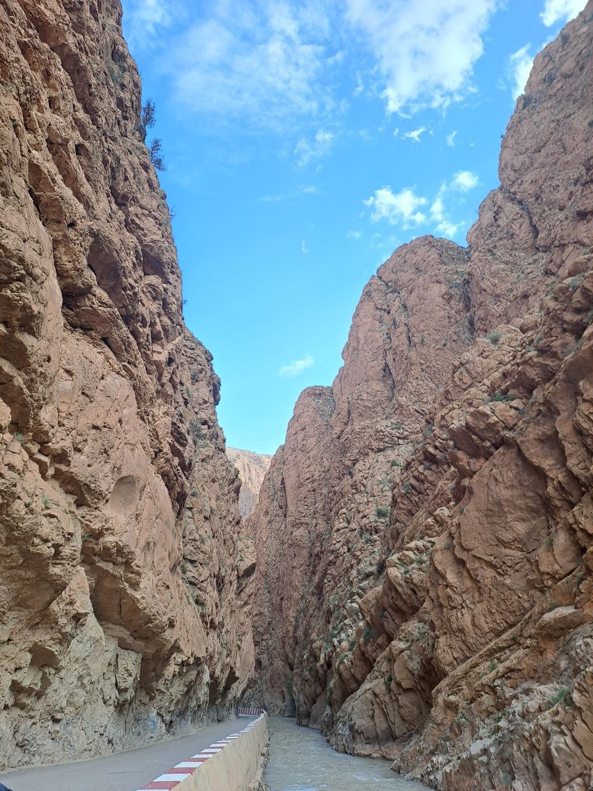
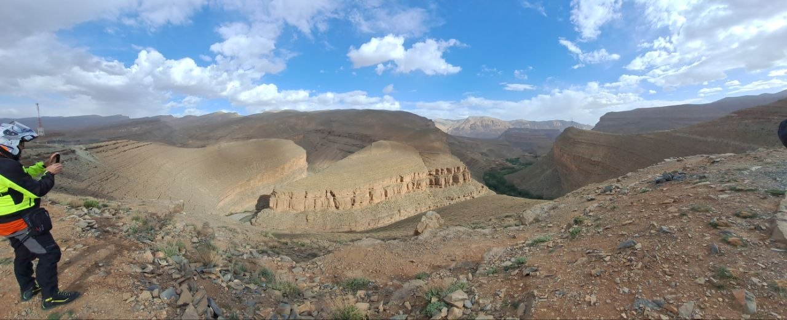
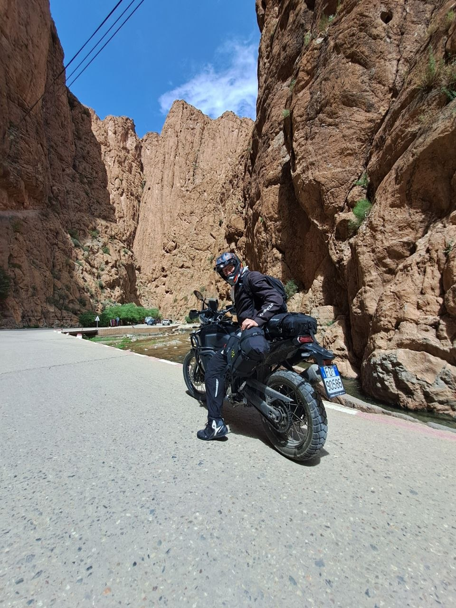
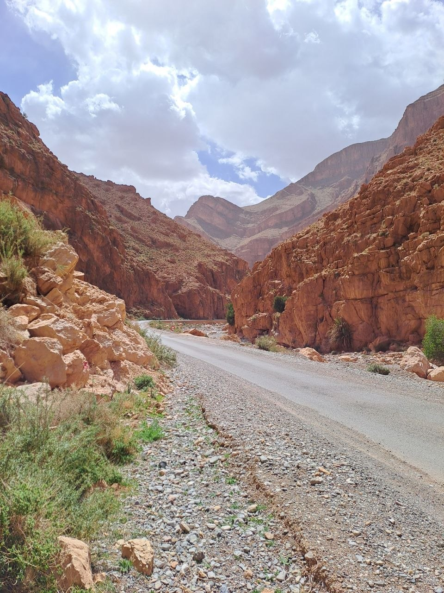
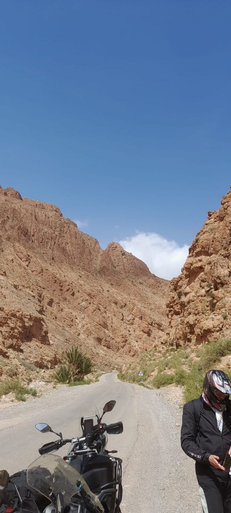

This morning, our group of seven set out from Merzouga, beginning another leg of our motorcycle tour through Morocco. Our journey was marked by stunning landscapes and an intriguing route that led us deeper into the region's impressive geological formations.

## Our Day's Route

Our first significant stop after departing Merzouga was Tighir. From there, we continued our ride, heading into the majestic Todra Gorges. These gorges are known for their towering canyon walls, which provided a dramatic backdrop to our ride. Following our time in Todra, our route took us towards the Dades Gorges, a highlight of the day.

## An Unconventional Path to Dades

Instead of adhering strictly to the most commonly recommended road from the Todra Gorges, we opted for an alternative route. We ventured north from the Todra Gorges onto a road that, until recently, was unpaved and challenging. This path has now been asphalted, offering a new and smoother experience for riders. This route led us through more impressive terrain, ascending northward and eventually guiding us toward Msemrir, a small Berber village. The decision to take this newly paved section allowed us to experience the fantastic canyons and gorges from a different perspective, providing a thrilling ride.

## Arrival in Dades Gorges

Having traversed these incredible geological features and passing through the Berber village, we arrived at our evening's destination: the Dades Gorges. The region is known for its dramatic rock formations and winding river. For the night, we have settled into a modest hotel within the Dades Gorges. Tomorrow, we plan to resume our journey directly from this location.

