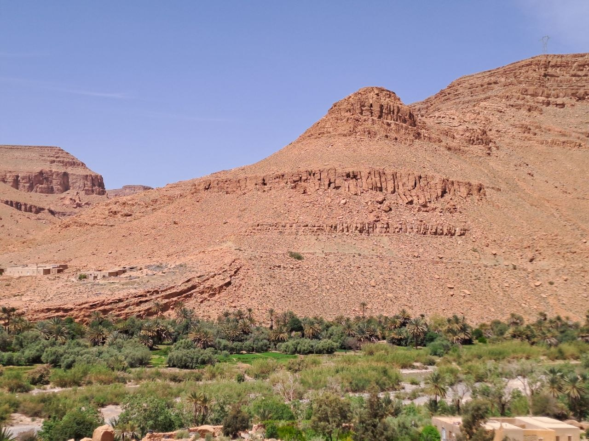
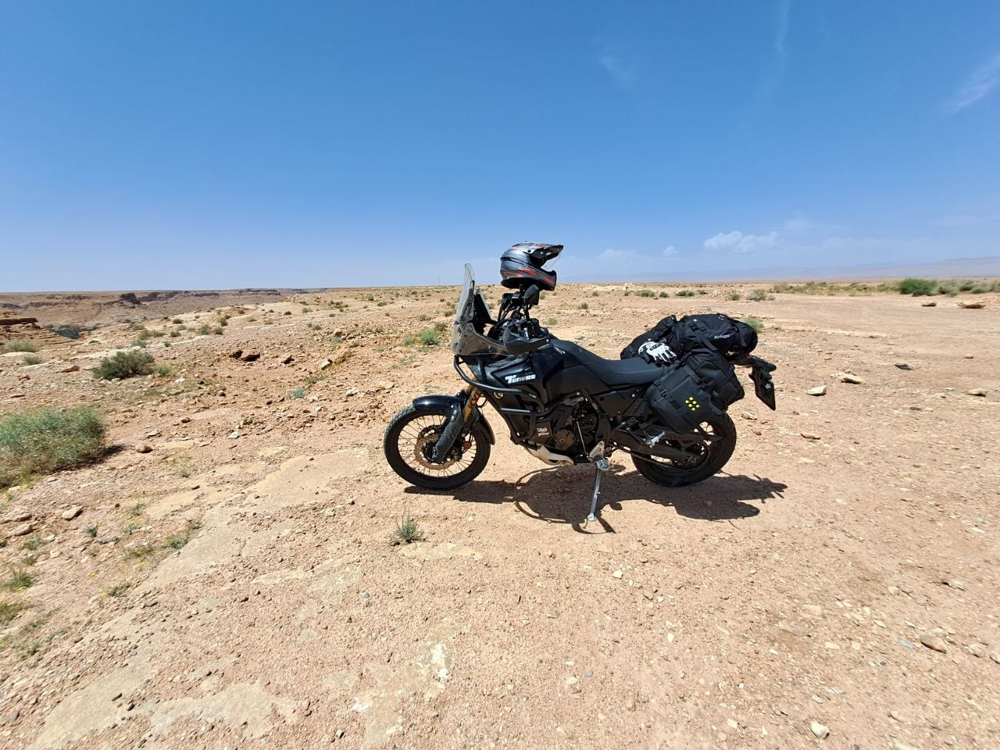
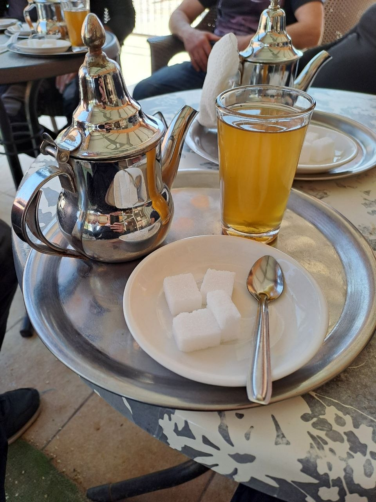
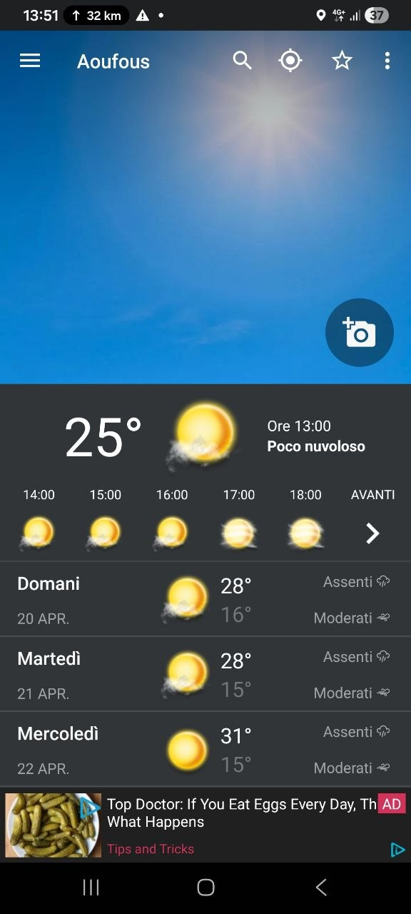
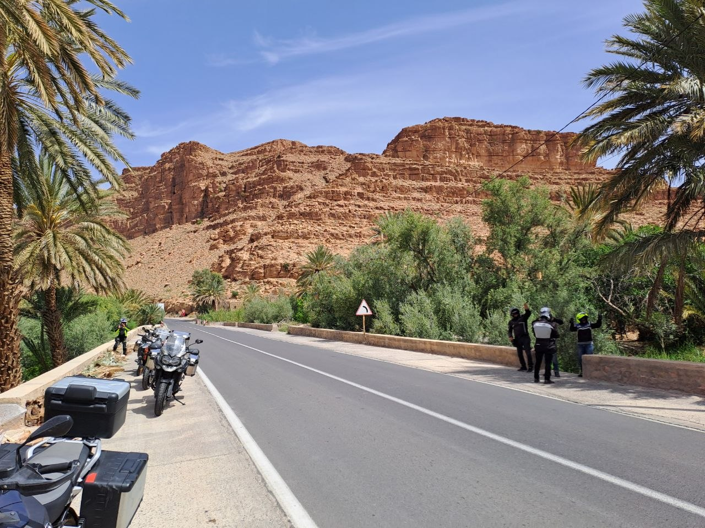
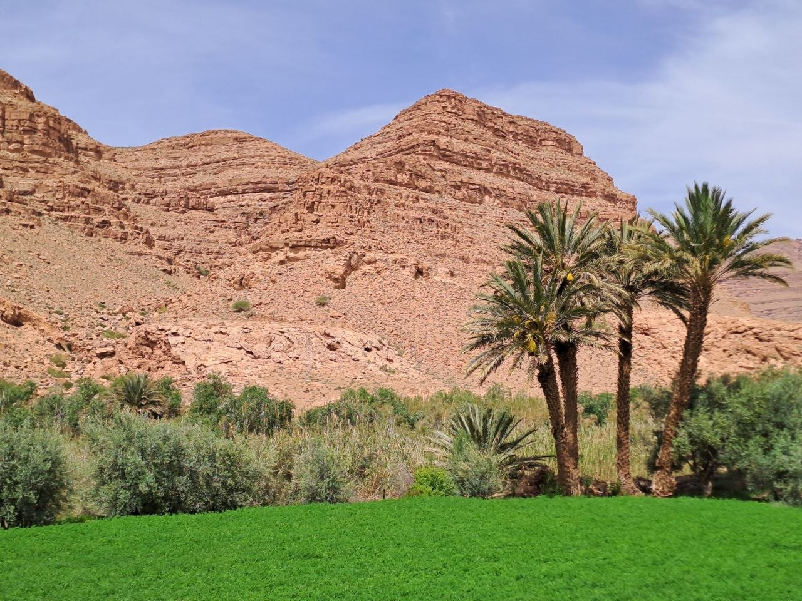
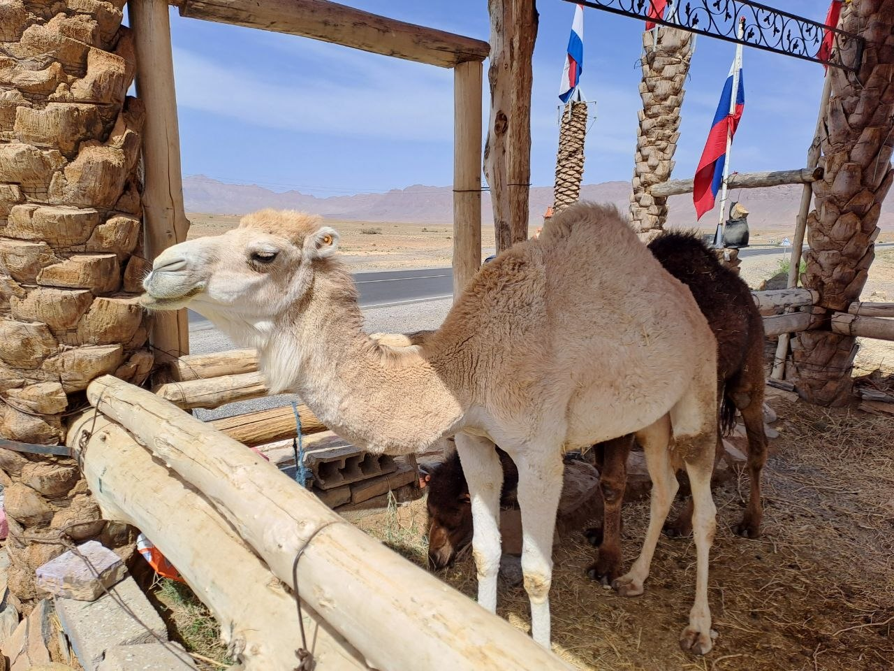
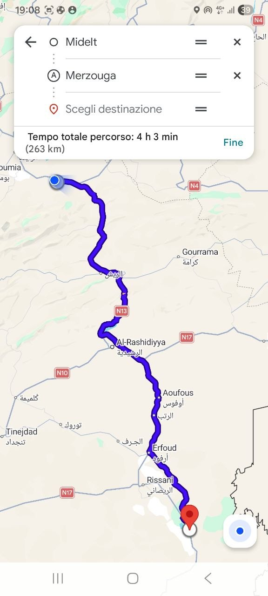

On April 19th, my six friends and I embarked on a motorcycle trip from Midelt, heading towards Merzouga. This journey took us through some of Morocco's most distinctive landscapes, covering an estimated distance of 265 kilometers.

## Our Journey from Midelt to Merzouga

We set out on April 19th with Merzouga as our destination, departing from Midelt. The planned route, roughly 265 kilometers, was initially estimated to take around 4 hours and 30 minutes. However, our actual travel time extended beyond this due to numerous stops we made along the way for photography. The roads were generally clear with minimal traffic, allowing us to maintain a comfortable pace and fully absorb the surroundings.

## Exploring the Ziz Gorges and Oasis Valley

A significant portion of our route traversed the Ziz Gorges, an impressive natural feature where the Ziz River has carved a deep canyon through the High Atlas Mountains. The views here were striking, with dramatic rock formations. The river fosters a vibrant oasis system, supporting extensive palm groves that stretch as linear green ribbons through the otherwise arid landscape. We passed through several of these oases, including those near Aoufous, a location where we observed the local weather conditions, showing 25°C. These oases are characterized by lush greenery, providing a stark contrast to the surrounding desert and mountainous terrain.

The Ziz River, which formed these gorges, is the primary water source for this arid region. It flows south through the valley, nourishing a chain of oases before eventually disappearing into the sands of the Sahara. The surrounding terrain transitions from the rugged peaks of the High Atlas to the high plains and eventually the pre-Saharan landscape, characterized by red-brown sedimentary rock formations and dry riverbeds, locally known as wadis. The climate in this area is typically dry, with significant temperature variations between day and night, reflecting the desert environment we were approaching.

## Cultural Encounters and Off-Road Adventure

During our ride, we encountered various points of interest. We stopped at what appeared to be an ancient mud village, a fortified structure typical of the region's historical architecture. These villages, often built from rammed earth, are a testament to the local building traditions and blend seamlessly into the natural landscape. Further along, we paused at a Berber hut, where we had the opportunity to take photographs and experience a local tea service. This stop also allowed for a brief off-road excursion. While the terrain was relatively simple, it provided an enjoyable diversion from the main road.

