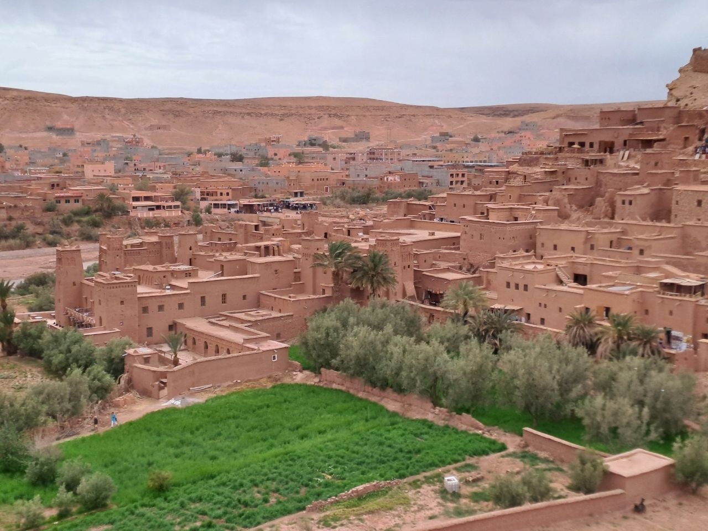
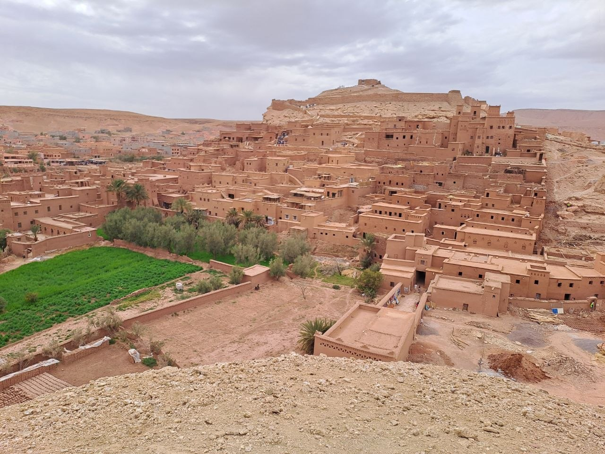
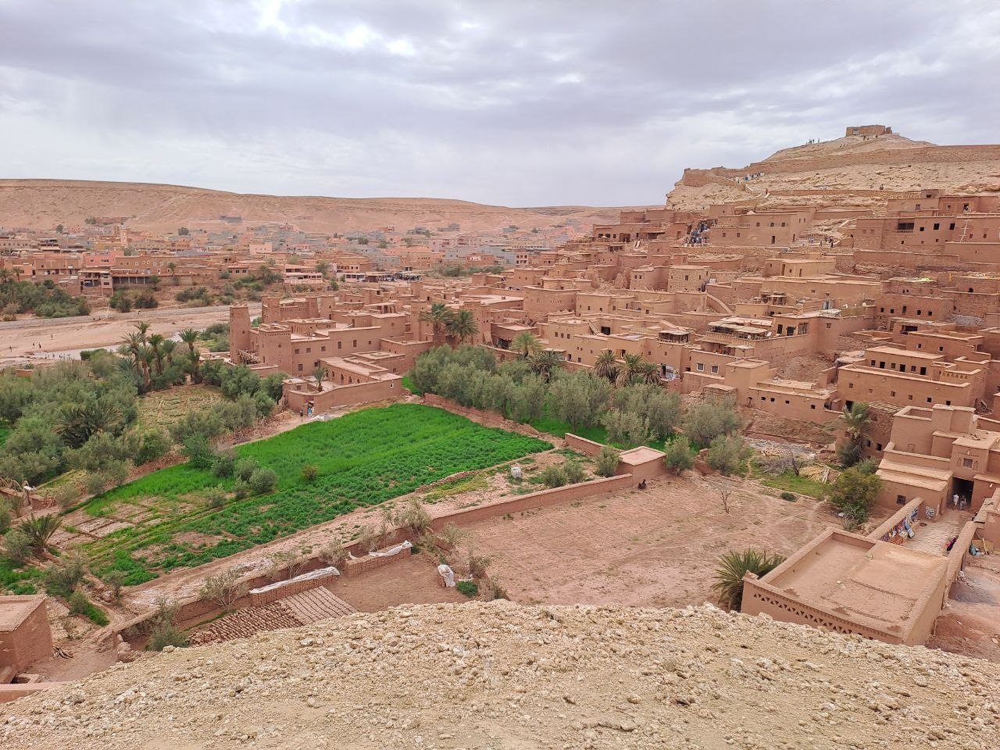
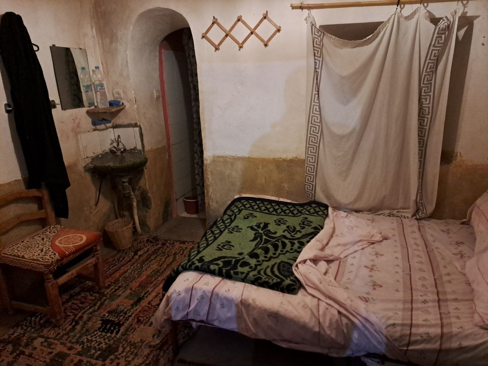
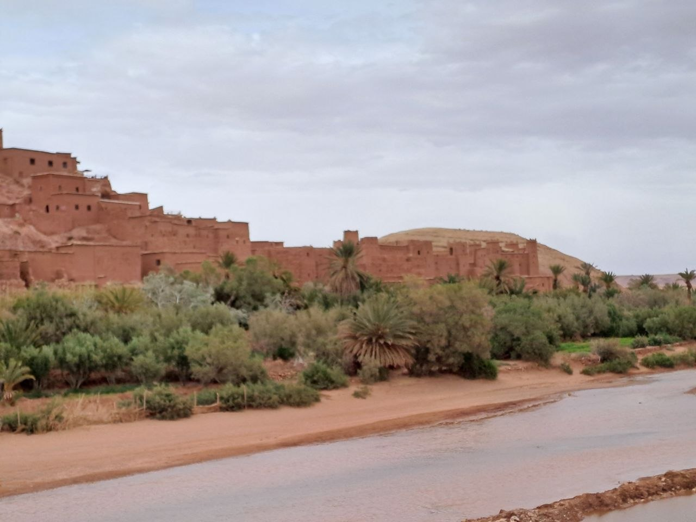
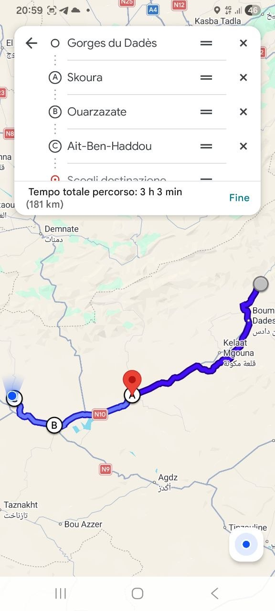

On April 21st, our group of seven embarked on a motorcycle journey from the Dades Gorges, heading towards the historic Ksar of Ait Ben Haddou. We departed early in the morning, between 8:30 and 9:00 AM, ready to cover the planned route.

## Our Journey to Ait Ben Haddou: Route and Terrain
Our route took us approximately 181 kilometers, with an estimated travel time of just over three hours. Starting from the dramatic landscapes of the Dades Gorges, we navigated through varying terrain. The journey included passing through notable points such as Skoura and Ouarzazate before reaching our final destination. The road traversed areas characteristic of the Moroccan landscape, from initial mountainous stretches around the gorges to more arid, desert-like expanses as we approached Ait Ben Haddou. The ksar itself is situated on a hill overlooking a river valley, showcasing the adaptive architecture of the region to both topography and climate.

## Exploring Ait Ben Haddou: History and Cinematic Legacy
Ait Ben Haddou is a fortified village, or ksar, recognized as a UNESCO World Heritage site. Its history dates back centuries, serving as a crucial stop along the ancient trans-Saharan trade route between Marrakech and the Sahara. The ksar is a remarkable example of traditional pre-Saharan earthen architecture, with its reddish-brown mud-brick buildings clustered together, designed for collective defense and community living. Beyond its historical significance, Ait Ben Haddou has gained international fame as a prominent filming location. Its unique and well-preserved appearance has attracted numerous film productions, making it a familiar backdrop in various cinematic works and adding to its allure.

## Our Accommodation: A Traditional Kasbah
For our overnight stay, we secured accommodation in a kasbah. A kasbah, in North Africa, generally refers to a type of fortress, often including a residential quarter, or a fortified house, particularly in rural areas. It serves as both a defensive structure and a dwelling. While the kasbah we found was quite basic, and perhaps not the most comfortable by conventional standards, it ultimately served its purpose for a night's rest, providing a glimpse into traditional local lodging.

