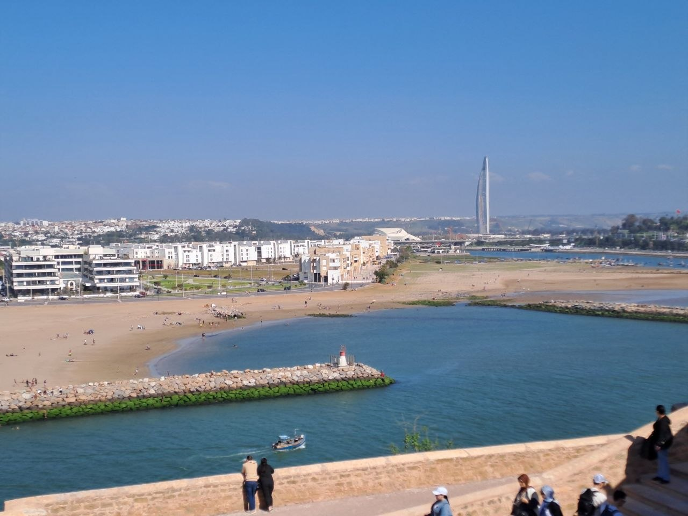

On April 25th, our motorcycle journey continued as the company of seven motorcyclists, including myself, embarked on a ride from El Jadida, a city on the Atlantic coast, to Kenitra. This particular leg of our trip, traversing a significant portion of the Moroccan landscape, proved to be a demanding stage, primarily as we navigated through various inhabited centers along the route. The day presented a series of unique challenges, from managing traffic to adapting to diverse road conditions, all while immersing ourselves in the dynamic environments of Morocco's coastal regions and urban expanses.

## A Demanding Ride Through Inhabited Centers

The initial hours of our ride from El Jadida were characterized by the sustained concentration required when traveling through inhabited areas. Unlike open stretches of highway, these segments demanded constant vigilance, as we navigated streets often shared by pedestrians, local vehicles, and various forms of informal transport. The need to maintain group cohesion, coupled with the necessity of anticipating sudden stops or changes in road conditions, added to the demanding nature of this leg. We experienced varying surfaces, from smoothly paved sections to areas that hinted at the 'uneven roads' we would later encounter more explicitly. Each town and village presented its own micro-environment, requiring adaptable riding techniques and a heightened awareness of our surroundings before we reached the vibrant metropolis of Rabat.

## A Stop in Rabat: Medina and Coastal Views

Our route included a planned and much-anticipated stop in Rabat, where we paused for approximately three hours. This break allowed us ample time to immerse ourselves in the city's rich history and vibrant atmosphere. We dedicated a portion of our time to exploring Rabat’s historic Medina, a labyrinthine quarter that stands as a testament to centuries of Moroccan culture. The Medina is characterized by its narrow, winding alleys, bustling with activity, where local vendors display an array of goods, from textiles and handicrafts to spices and fresh produce. The air is typically rich with the aromas of street food and exotic spices, and the sounds of bartering and daily life create an engaging, if somewhat chaotic, sensory experience. Following our exploration of the Medina's hidden passages and lively squares, we made our way to the coastal fortifications to take a closer look at the expansive Atlantic Ocean.

From our elevated vantage point atop the ramparts, likely those of the historic Kasbah of the Udayas, the views of the Atlantic Ocean were truly striking and encompassed a broad panorama. We observed the robust, ancient stone walls of the citadel, with their weathered texture and strategic embrasures, providing a powerful contrast to the lush green lawns that sloped gently downwards. Several palm trees swayed gently in the coastal breeze, casting long shadows under the clear blue sky. Below us, the Bou Regreg River estuary gracefully met the vast expanse of the ocean. Long, moss-covered stone jetties, acting as protective barriers, extended far into the water, defining the river's mouth and guiding its flow. The water itself displayed varying shades of blue and turquoise, with gentle waves breaking along the sandy beaches. These beaches, visible in the distance, were dotted with numerous people enjoying the sun and surf. We noted the presence of various watercraft, from small fishing boats to a quick-moving jet ski leaving a white wake across the blue surface. Across the river, the modern skyline of Salé emerged, featuring contemporary buildings and a distinct, slender skyscraper, illustrating the fascinating interplay of historical preservation and modern development that characterizes this significant Moroccan coastal region. This perspective offered a profound sense of the city's strategic importance and natural beauty.

## Rabat: A City of Orderly Contrasts

Our collective impressions of Rabat were profoundly positive; we found it to be a city that possessed an undeniable and pervasive beauty. Rabat stood out conspicuously as a surprising, modern, and notably orderly urban center. This distinct and refreshing character immediately set it apart from many other Moroccan cities we had encountered and grown accustomed to throughout our journey. Many of these other urban environments were often defined by a more pronounced and palpable sense of chaos, albeit a chaos that was undeniably full of life and teeming with vibrant energy. These more bustling cities typically present a kaleidoscopic blend of intense colors from market stalls and traditional garments, a medley of strong smells wafting from street food vendors and spice markets, a cacophony of voices from lively conversations and spirited bartering, and an omnipresent chorus of shouts from street hawkers and children playing. This creates an immersive and often overwhelming sensory experience, a constant symphony of Moroccan daily life.

In stark contrast, Rabat, while certainly a populous and busy city, maintained a remarkable sense of structural order and overall cleanliness. The wider avenues, well-maintained public spaces, and seemingly more organized flow of activity contributed to this perception. This characteristic provided a distinctly different kind of urban experience, showcasing a more structured and perhaps more predictable environment for navigation and exploration. Despite Rabat's unique appeal and impressive blend of modernity and history, I must note that my personal preferences for Moroccan cities continue to be Marrakech and Fes. These cities, with their deep historical roots and intricate cultural tapestries, remain especially captivating to me among my diverse travel experiences in the region.

## Navigating the Realities of Moroccan Traffic

Reflecting on the entirety of the day's ride, it was an experience that proved annoying at various points, predominantly due to the pervasive and often challenging traffic conditions we encountered. Moroccan traffic, in our observation, operates with a highly decentralized and often disorderly rhythm, presenting a continuous test of skill and patience for motorcyclists. The state of the roads outside the principal urban areas frequently proved to be uneven, featuring sections with potholes, loose gravel, or variable paving, which added another layer of complexity to maintaining a steady and safe pace. Furthermore, on these inter-city routes, we consistently observed a considerable volume of heavy vehicle traffic—trucks and buses—which necessitated an increased degree of vigilance, defensive riding strategies, and careful maneuvering to ensure the safety and cohesion of our group.

Within the dense confines of Moroccan cities, the traffic dynamics shifted dramatically, yet the inherent challenges persisted, if not intensified. Urban centers are characterized by a seemingly unending coming and going of mopeds, creating an environment that verges on the absurd in its intensity and unpredictability. The sheer density of these agile, two-wheeled vehicles, coupled with their often spontaneous movements, rendered city riding particularly demanding. It requires constant focus, split-second decision-making, and an acute awareness of every angle. This pervasive urban moped traffic, in its density and lack of conventional road discipline, appears to be an even more formidable challenge than navigating the notoriously narrow and bustling alleys of Naples; indeed, in our experience, it is certainly more chaotic and inherently riskier. Despite the considerable difficulties and frustrations presented by these unique traffic conditions, experiencing this distinct reality firsthand was an interesting and insightful aspect of truly understanding the complexities of the Moroccan road network and the rhythm of its urban daily life.

## Arrival and Plans in Kenitra

Following our insightful and relatively lengthy three-hour stop in Rabat, we resumed our journey northwards, ultimately arriving in Kenitra, our designated destination for the day. The transition from the demanding ride and the vibrant city experiences to the relative quiet of our arrival was a welcome one. Upon reaching Kenitra, our immediate plans were to unwind and refresh ourselves after the demanding hours spent on the road. This included taking a much-needed wash to shake off the dust and fatigue of the journey. Subsequently, with our energy somewhat restored, we intended to embark on a walk around the city, eager to explore Kenitra’s local atmosphere, observe its distinct character, and perhaps discover its unique offerings before bringing our eventful day to a close.

**AI disclosure:** This text was generated by AI from audio notes recorded by the site owner.
