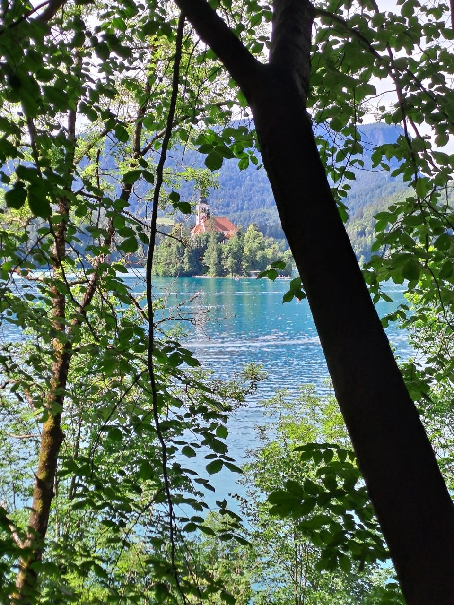
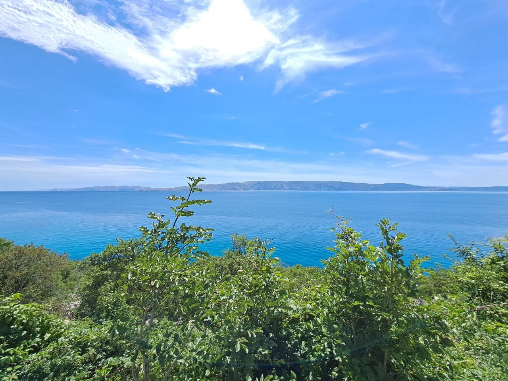
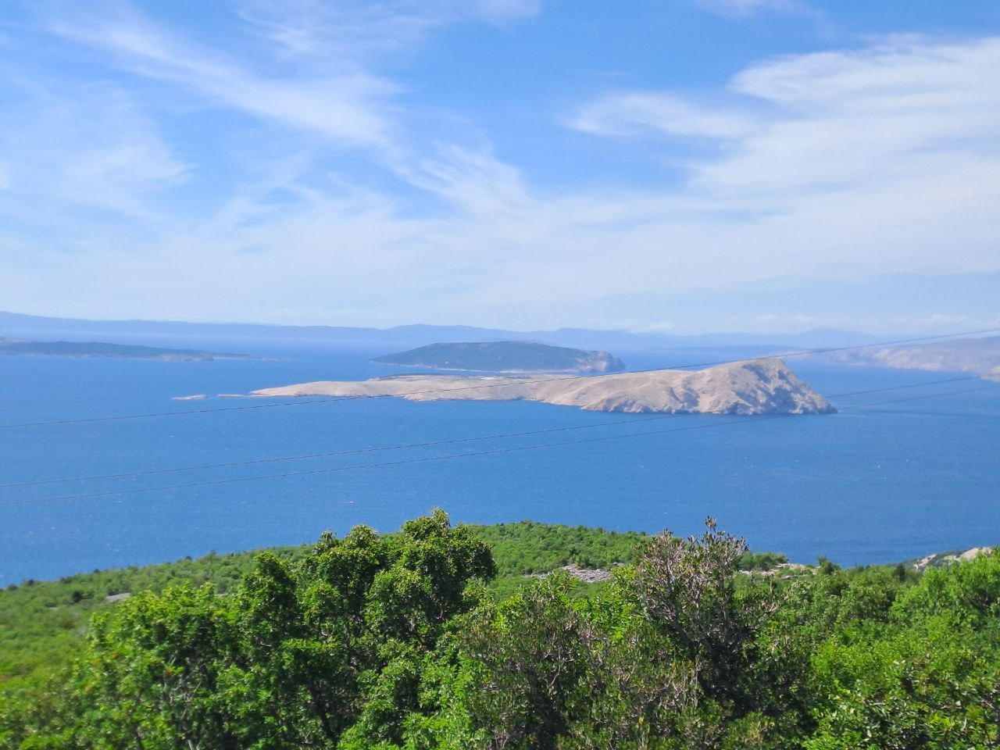
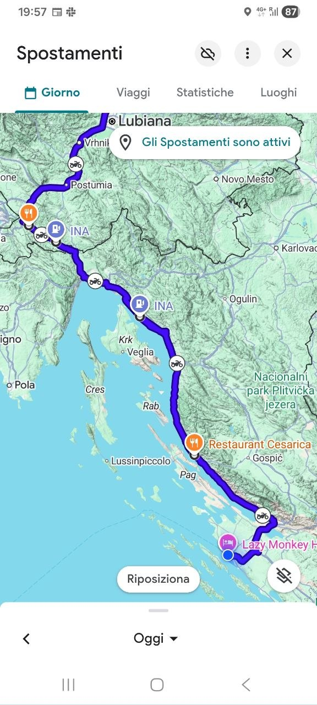
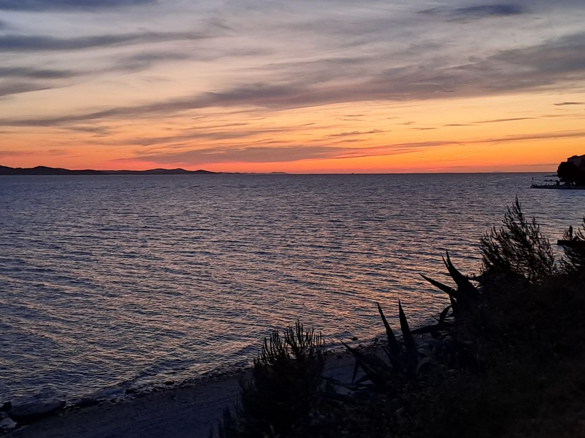
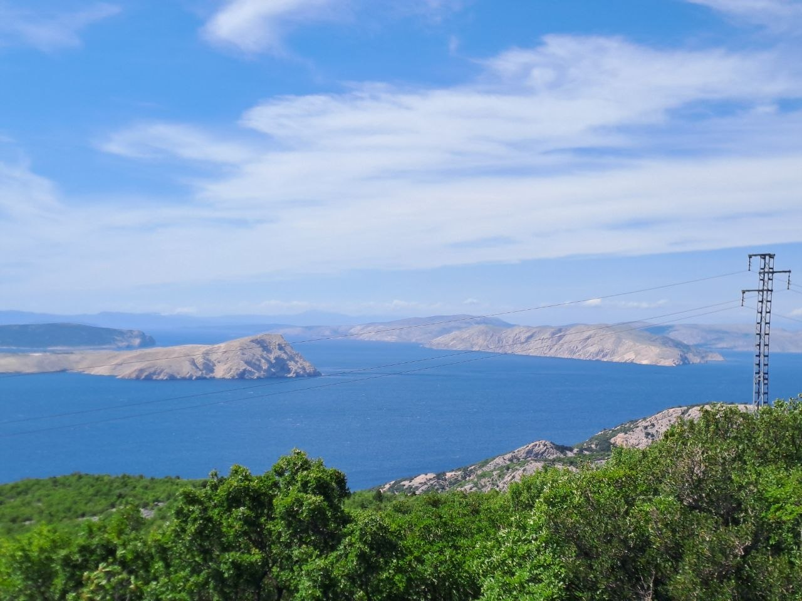

I launched into a significant motorcycle expedition on June 11th, setting off from Verucchio with the initial segments of what is planned to be a two-month journey. My ultimate destinations are set to be Albania, with the possibility of extending even further south into Greece. This ambitious itinerary underscores a desire for extensive exploration and a truly nomadic experience on two wheels. The initial three days of this grand tour have been exceptionally rich in diverse landscapes and memorable riding experiences, providing a robust start to what promises to be an extraordinary adventure across varied terrains and cultures. They presented an immediate plunge into the beauty and challenges of long-distance motorcycle touring, from the quiet hum of transit to the exhilarating sweep of mountain passes and the tranquil expanse of coastal routes.

## Day One: The Initial Overture

The first day of my journey, June 11th, served primarily as a transit stage. Departing from Verucchio, the initial focus was on covering a substantial distance to position myself for the more intricate and scenic routes awaiting in Slovenia. While this day lacked specific points of interest or dramatic scenery, it was crucial for settling into the rhythm of extended travel. It involved calibrating my riding posture, ensuring my Yamaha Ténéré World Raid was performing optimally, and mentally preparing for the diverse challenges and rewards of the coming weeks. Such initial travel days, though less narratively captivating, are fundamental to any long-distance motorcycle tour, allowing for a gradual immersion into the journey ahead and a readiness for the adventures to unfold. It’s a period of anticipation, where the landscape gradually shifts and the promise of new experiences draws closer with every kilometer.

## Day Two: Ascending to Slovenian Majesty

My second day, June 12th, marked a dramatic and exhilarating turn in the journey as I entered Slovenia and headed directly into its alpine heart. The destination for the night was a charming and uniquely situated hostel known as Erjavčeva koča, nestled high in the mountains near Kranjska Gora. The route leading to this alpine haven was the legendary Vršiča cesta, often referred to as the Vršič Pass. This road, famous for its intricate design and challenging curves, lived up to every expectation.

Riding the Vršič Pass on my 2023 Yamaha Ténéré World Raid was an experience in pure motorcycling pleasure. The road is characterized by its numerous hairpin turns, a series of tightly wound bends that demand focused riding and precise control. Each turn presented a new vista, with the majestic Julian Alps rising steeply on either side, their rugged peaks touching the sky, and dense pine forests blanketing the lower slopes. The Ténéré, built for such adventurous terrains, navigated the demanding switchbacks with impressive agility and stability, allowing me to fully immerse myself in the dynamic ride. The ascent and descent through these serpentine roads offered not just a physical challenge but also a constant visual feast. The air grew crisper with altitude, and the panoramas expanded with every climb, revealing the sheer scale of the Slovenian alpine landscape.

Upon successfully conquering the Vršič Pass and arriving at Erjavčeva koča, I took the opportunity to explore one of Slovenia's most iconic natural attractions. A visit to Lake Bled was an essential part of the day's itinerary. The lake, with its serene turquoise waters and the enchanting island featuring the Pilgrimage Church of the Assumption of Mary, presented a scene of unparalleled beauty. Framed by lush greenery and the distant mountains, it offered a tranquil respite from the day's exhilarating ride. The contrasting experience of navigating the demanding mountain pass and then finding peace by the calm waters of Lake Bled highlighted the diverse wonders Slovenia offers. Following this visit, I spent more time riding through the local mountains, taking in additional scenic routes that provided further opportunities to appreciate the region's natural splendor and the joy of riding through such pristine environments.

## Day Three: From Alpine Peaks to Adriatic Shores

My third day, June 13th, unfolded as the most visually stunning and dynamically engaging segment of the journey so far. It perfectly encapsulated the transition from Slovenia's majestic alpine landscapes to the vibrant, sun-drenched coast of Croatia. My day began with a descent from the high-altitude comfort of Erjavčeva koča. The morning ride involved navigating the winding roads downwards, leaving the crisp mountain air behind as I headed into the valley towards Kranjska Gora. This descent offered a magnificent perspective of the sprawling alpine scenery, watching as the towering peaks gradually receded into the background and the valley floor unfolded ahead.

From Kranjska Gora, I made a decisive right turn, embarking on a new route that would lead me steadily south. This particular road, though its official designation I cannot recall, distinguished itself by closely following the natural contours of a river. The journey alongside the meandering waterway was characterized by a gentler terrain compared to the steep inclines of the previous day, passing through verdant valleys and alongside quaint, often unseen, rural landscapes. The road offered a fluid and enjoyable ride, preparing me for the increasing speeds and distances ahead.

My general trajectory was set towards Ljubljana. However, in keeping with the spirit of seeking open roads and avoiding urban complexities, I opted to bypass the city center. Instead, I navigated around its periphery, preferring the flow of the open highway. This strategic choice allowed me to maintain a steady pace and minimize time spent in city traffic, maximizing the pure riding experience. Eventually, my route transitioned onto the A1 highway, guiding me purposefully in the direction of Kosina. This segment was an efficient stretch, allowing for a good covering of distance as I steadily made my way towards the Adriatic.

A significant and much-anticipated stop on this leg of the journey was for lunch at Gostilna in Sobe pri Krizmanu. This traditional eatery provided a perfect opportunity to sample the local gastronomy. My choice, a succulent roasted suckling pig accompanied by perfectly oven-baked potatoes and a generous serving of mixed, fresh vegetables, proved to be an exceptional culinary experience. The rich, savory flavors of the pork, combined with the wholesome sides, offered a deeply satisfying and authentic taste of the region. It was a moment of true indulgence, providing a delightful interlude and the necessary sustenance for the continuation of my extensive ride.

With renewed energy, I resumed my journey, and the landscape began to undergo a noticeable transformation. The route from Gostilna in Sobe pri Krizmanu progressively led me towards the coast, specifically to Fiume, known internationally as Rijeka, marking my entry into Croatia's stunning coastal region. The transition was gradual yet palpable: the air grew warmer, the vegetation shifted from alpine forests to more Mediterranean flora, and the distant, shimmering azure of the Adriatic Sea began to appear through gaps in the trees. This approach to the coast was incredibly picturesque, winding through a mix of wooded areas and open stretches, revealing breathtaking panoramas of the sea. Large, mature trees, some resembling ancient plane trees, lined parts of the route, creating beautiful natural archways.

Upon reaching the Adriatic, I merged onto the E65, which is famously known as the Adriatic Highway. This road immediately proved to be an absolute highlight, truly deserving the descriptor of "spectacular." The E65 is a motorcyclist's dream, an undulating ribbon of asphalt that hugs the coastline, offering an almost continuous series of curves and winding sections. Each bend unfolded new breathtaking vistas of the crystal-clear sea, scattered islands, and the rugged, sun-drenched coastline of Croatia. The vibrant blue hues of the water, extending to the horizon, were mesmerizing.

Despite its numerous turns, the E65 presented a ride that was both exhilarating and manageable, never feeling overly difficult or strenuous. The traffic, remarkably, was quite reasonable, allowing for a consistent and flowing pace that amplified the enjoyment of the ride. The sensation of the sea breeze, the panoramic views, and the rhythmic flow of the road combined to create an immersive and unforgettable riding experience. I continued on this magnificent coastal artery, tracing the beautiful Croatian shoreline all the way down to Zadar, a significant port city and a fitting destination to conclude the third day of this remarkable motorcycle journey. The transition from the high Alps to the sun-drenched Adriatic coast encapsulated a vast array of riding pleasures and scenic diversity in just a few days.

**AI disclosure:** This text was generated by AI from audio notes recorded by the site owner.
